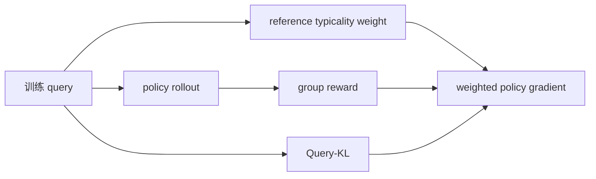
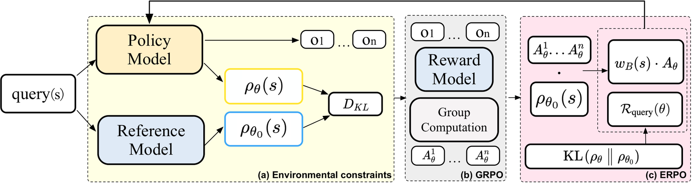

# ERPO：把策略漂移约束从回答侧移到问题侧

> **复现级别：核心机制 candidate-policy。** 实际执行 reference typicality weight 与 Query-KL，且响应侧 Policy-KL 系数固定为零。

## 论文信息

| 字段 | 内容 |
|---|---|
| 论文链接 | [arXiv 2608.23311](https://arxiv.org/abs/2608.23311) |
| 公司 / 机构 | 高德 / 阿里巴巴集团（第一作者第一署名单位） |
| 首次公开日期 | 2026-08-24（arXiv v1） |
| 原作者代码 | 是：[alibaba/ERPO](https://github.com/alibaba/ERPO) |
| 本地 adapter / 方法 | `erpo` |
| 本地复现代码 | [`src/auto_research/post_training/latest_20260825.py`](https://github.com/daiwk/auto-research/blob/main/src/auto_research/post_training/latest_20260825.py) |

## 原始论文总结

### 背景与主要改动

传统 Policy-KL 直接压回答分布，稳定训练的同时消耗探索预算。ERPO 观察到 RL 过程中模型诱导的问题分布也会漂移，于是把正则放到输入侧：用冻结 reference 的问题似然给 query 静态加权，再以 Query-KL 控制环境分布漂移，不直接对 response score function 施压。



<!-- paper-figure:start -->
### 原论文关键图

[](https://arxiv.org/html/2608.23311v1/main_pipeline_final.png)

> **原论文 Figure 2（关键图）**：展示原论文方法的总体设计和关键组成。图片来自[原论文](https://arxiv.org/abs/2608.23311)，版权归原作者所有；点击图片可查看来源。
<!-- paper-figure:end -->

### 核心公式

$$
\mathcal R_{query}(\theta)=\mathrm{KL}(\rho_\theta\|\rho_{\theta_0}),\qquad
w^*(q)=\frac{\rho_{\theta_0}(q)}{\rho_{train}(q)},
$$

$$
\mathcal L_{ERPO}=-\mathbb E[w(q)g(q,o)]+\alpha\mathcal R_{query}(\theta).
$$

### 论文离线与线上效果

论文在六个数学推理 benchmark 上报告 ERPO 替换 Policy-KL 后的准确率和长程稳定性提升，尤其在高温采样下控制 query distribution drift；没有工业线上 A/B。

## 本地复现

同一初始 candidate policy、arithmetic-smoke、100 steps、seed 42。基线 accuracy **0.1953**，ERPO **0.6094**（+212.0%）；最终 Query-KL **0.00566**，响应 Policy-KL 系数为 **0**。指标见 [`metrics/arithmetic-smoke-seed42.json`](metrics/arithmetic-smoke-seed42.json)。

本批次统一索引见 [`../../experiments/latest-20260825-seed42.json`](../../experiments/latest-20260825-seed42.json)。

```bash
auto-research post-train --algorithm erpo --dataset arithmetic-smoke --steps 100 --seed 42
```

## 复现边界

本地将 candidate typicality 作为 query-likelihood 代理，验证梯度边界和稳定性控制流；没有训练真实 LLM 或复跑六个论文 benchmark。
