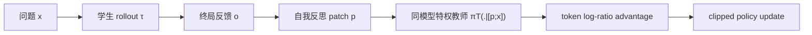
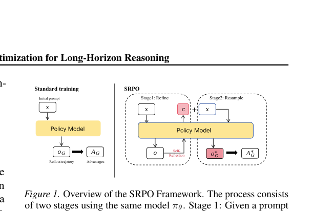

# SRPO：用自我反思把终局奖励变成 token 级信用

> **复现级别：核心机制 candidate-policy。** 实际执行反思 patch、reflection-conditioned teacher score 和稠密 advantage；没有把小型策略代理结果写成 Qwen3-8B 训练结果。

## 论文信息

| 字段 | 内容 |
|---|---|
| 论文链接 | [arXiv 2608.23493](https://arxiv.org/abs/2608.23493) |
| 公司 / 机构 | 武汉大学（第一作者第一署名单位） |
| 首次公开日期 | 2026-08-24（arXiv v1） |
| 原作者代码 | 是：[Galleons2029/SRPO](https://github.com/Galleons2029/SRPO) |
| 本地 adapter / 方法 | `srpo` |
| 本地复现代码 | [`src/auto_research/post_training/latest_20260825.py`](https://github.com/daiwk/auto-research/blob/main/src/auto_research/post_training/latest_20260825.py) |

## 原始论文总结

### 背景与主要改动

长轨迹只给终局 reward 时，很难知道具体哪个 token/动作导致失败。SRPO 让当前模型先根据完整轨迹和环境结果写出简短 reflection patch，再把 patch 拼回原问题；同一个模型在这个特权上下文中充当教师，对学生的 on-policy rollout 给出逐 token 分数。



<!-- paper-figure:start -->
### 原论文关键图

[](https://arxiv.org/pdf/2608.23493#page=3)

> **原论文 Figure 1（关键图）**：展示原论文提出的核心架构、主要模块及其连接关系。图片来自[原论文](https://arxiv.org/abs/2608.23493)，版权归原作者所有；点击图片可查看来源。
<!-- paper-figure:end -->

### 核心公式

$$
p=\operatorname{Reflect}_{\pi_\theta}(x,\tau,o),\qquad
\pi_T(\cdot\mid x)=\pi_\theta(\cdot\mid[p;x]),
$$

$$
r_t=\operatorname{sg}\!\left[\log\pi_T(a_t\mid s_t)-
\log\pi_{\theta_{old}}(a_t\mid s_t)\right],\quad
A_t=r_t-\frac{1}{|\mathcal V|}\sum_{j\in\mathcal V}r_j.
$$

### 论文离线与线上效果

Qwen3-8B 在 AIME'24 达到 **73.3%**，训练 FLOPs 为 scaled SFT 的 **0.08×**；WebShop、ALFWorld、SWE-Bench-Lite 分别为 **64.7% / 76.8% / 31.2%**。论文没有工业线上 A/B。

## 本地复现

同一初始 candidate policy、arithmetic-smoke 512 train / 128 validation、100 steps、seed 42。未训练基线 accuracy 为 **0.1953**，SRPO 为 **0.5703**（+192.0%）；最后一个 batch 生成 3 个非零 reflection patch。指标见 [`metrics/arithmetic-smoke-seed42.json`](metrics/arithmetic-smoke-seed42.json)。

本批次统一索引见 [`../../experiments/latest-20260825-seed42.json`](../../experiments/latest-20260825-seed42.json)。

```bash
auto-research post-train --algorithm srpo --dataset arithmetic-smoke --steps 100 --seed 42
```

## 复现边界

本地策略代理用 outcome/process reward 构造同方向的反思稠密信用，没有运行 Qwen3-8B、WebShop、ALFWorld、SWE-Bench 或真实 token rollout。
