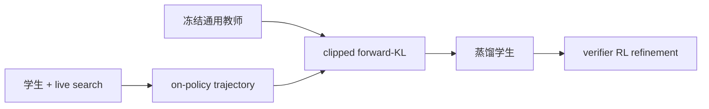
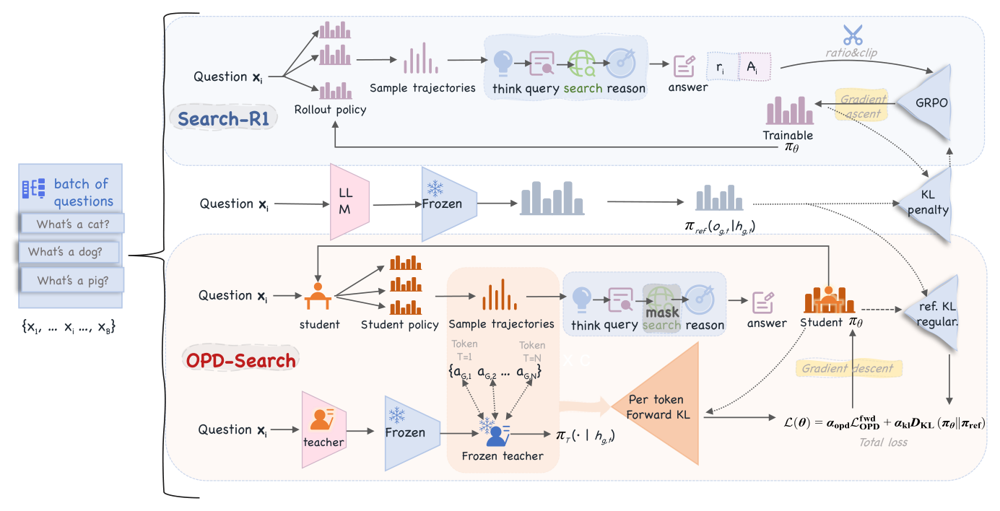

# OPDSearch+：冻结通用教师蒸馏后再做搜索 RL

> **复现级别：核心机制 candidate-policy。** 实际执行 clipped forward-KL 与后续 verifier RL 两阶段目标；未训练 Qwen2.5-3B 搜索 Agent。

## 论文信息

| 字段 | 内容 |
|---|---|
| 论文链接 | [arXiv 2608.24310](https://arxiv.org/abs/2608.24310) |
| 公司 / 机构 | University of Chinese Academy of Sciences（第一作者第一署名单位） |
| 首次公开日期 | 2026-08-25（arXiv v1） |
| 原作者代码 | 否：未发现公开代码（核查日期：2026-08-26） |
| 本地 adapter / 方法 | `opd-search-plus` |
| 本地复现代码 | [`src/auto_research/post_training/latest_20260826.py`](https://github.com/daiwk/auto-research/blob/main/src/auto_research/post_training/latest_20260826.py) |

## 原始论文总结

### 背景与主要改动

搜索 Agent 的多轮 SFT 数据昂贵，任务专用教师又需先训练。OPDSearch+ 直接冻结通用 instruct teacher，在学生自己的在线搜索轨迹上用 forward-KL 蒸馏 query、推理和答案 token；随后 RL 从更好的行为分布继续优化，突破教师与纯 RL 的局部最优。



<!-- paper-figure:start -->
### 原论文关键图

[](https://arxiv.org/html/2608.24310v1/fig_overview.png)

> **原论文 Figure 2（关键图）**：展示原论文提出的核心架构、主要模块及其连接关系。图片来自[原论文](https://arxiv.org/abs/2608.24310)，版权归原作者所有；点击图片可查看来源。
<!-- paper-figure:end -->

### 核心公式

$$
r_t=\frac{\pi_T(o_t\mid o_{<t})}{\pi_\theta(o_t\mid o_{<t})},\quad
\nabla\mathcal L_{OPD}=-\frac1{|\mathcal M|}\sum_t\operatorname{clip}(r_t,\epsilon,R_{max})\nabla\log\pi_\theta(o_t).
$$

### 论文离线与线上效果

3B 学生七个 QA benchmark 平均 EM **0.4402**，超过此前最好 3B RL 的 **0.421**；HotpotQA 和 2Wiki 分别提高 **13.1% / 8.5%**。无工业线上 A/B。

## 本地复现

arithmetic-smoke、100 steps、seed 42：accuracy **0.1953 → 0.6641**。该单 seed 结果仅说明两阶段目标可执行，不能当成稳定提升。指标见 [`metrics/arithmetic-smoke-seed42.json`](metrics/arithmetic-smoke-seed42.json)，批次索引见 [`../../experiments/latest-20260826-seed42.json`](../../experiments/latest-20260826-seed42.json)。

```bash
auto-research post-train --algorithm opd-search-plus --dataset arithmetic-smoke --steps 100 --seed 42
```

## 复现边界

本地用候选级 process signal 代替真实 query/reasoning/answer token 与搜索引擎反馈；未运行 3B/14B 模型、Wikipedia index 或七个 QA benchmark。
