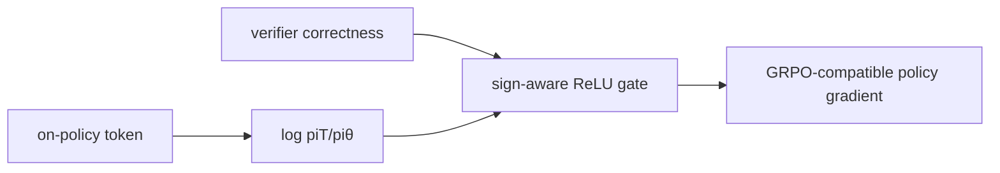
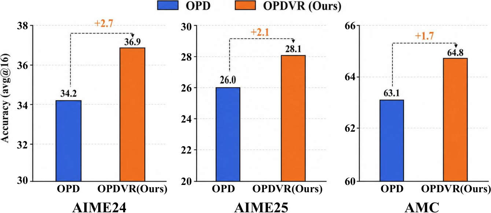

# OPDVR：用可验证奖励校正 OPD 隐式奖励符号

> **复现级别：核心机制 candidate-policy。** 实际执行 sampled-token 隐式奖励和 correctness-aware ReLU gate，不用加权超参数拼接 OPD/RLVR。

## 论文信息

| 字段 | 内容 |
|---|---|
| 论文链接 | [arXiv 2608.24696](https://arxiv.org/abs/2608.24696) |
| 公司 / 机构 | LeapLab，Tsinghua University（第一作者第一署名单位） |
| 首次公开日期 | 2026-08-25（arXiv v1） |
| 原作者代码 | 是：[LeapLabTHU/OPDVR](https://github.com/LeapLabTHU/OPDVR) |
| 本地 adapter / 方法 | `opdvr` |
| 本地复现代码 | [`src/auto_research/post_training/latest_20260826.py`](https://github.com/daiwk/auto-research/blob/main/src/auto_research/post_training/latest_20260826.py) |

## 原始论文总结

### 背景与主要改动

Sampled-token OPD 的隐式奖励由教师/学生概率比决定，可能给正确轨迹负奖励、给错误轨迹正奖励。OPDVR 不再额外混合一个 RL loss，而是直接用 verifier correctness 对该隐式奖励做单侧 ReLU：正确轨迹只保留非负教师信号，错误轨迹只保留非正信号。



<!-- paper-figure:start -->
### 原论文关键图

[](https://arxiv.org/html/2608.24696v1/OPD-OPDVR-acc.png)

> **原论文 Figure 1（关键图）**：展示原论文提出的核心架构、主要模块及其连接关系。图片来自[原论文](https://arxiv.org/abs/2608.24696)，版权归原作者所有；点击图片可查看来源。
<!-- paper-figure:end -->

### 核心公式

$$
R_{OPD}(o_t)=\log\frac{\pi_T(o_t\mid q,o_{<t})}{\pi_\theta(o_t\mid q,o_{<t})},
$$

$$
R_{OPDVR}=\mathbf1[y=1]\operatorname{ReLU}(R_{OPD})-\mathbf1[y=0]\operatorname{ReLU}(-R_{OPD}).
$$

### 论文离线与线上效果

同架构 Qwen3-4B 设置中，六个推理 benchmark 平均分从 sampled-token OPD 的 **47.8** 提升到 **49.1**；AIME24 为 **36.9**。无工业线上 A/B。

## 本地复现

arithmetic-smoke、100 steps、seed 42：accuracy **0.1953 → 0.6641**，最终 KL(reference) **0.0018**。单 seed 只验证 gate 与更新方向。指标见 [`metrics/arithmetic-smoke-seed42.json`](metrics/arithmetic-smoke-seed42.json)，批次索引见 [`../../experiments/latest-20260826-seed42.json`](../../experiments/latest-20260826-seed42.json)。

```bash
auto-research post-train --algorithm opdvr --dataset arithmetic-smoke --steps 100 --seed 42
```

## 复现边界

使用候选策略和精确 outcome 代理 token rollout；未运行 Qwen3、六个数学 benchmark 或真实 verifier rollout。
