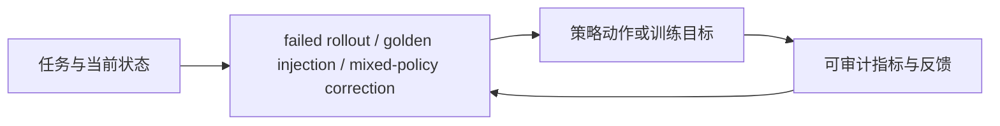
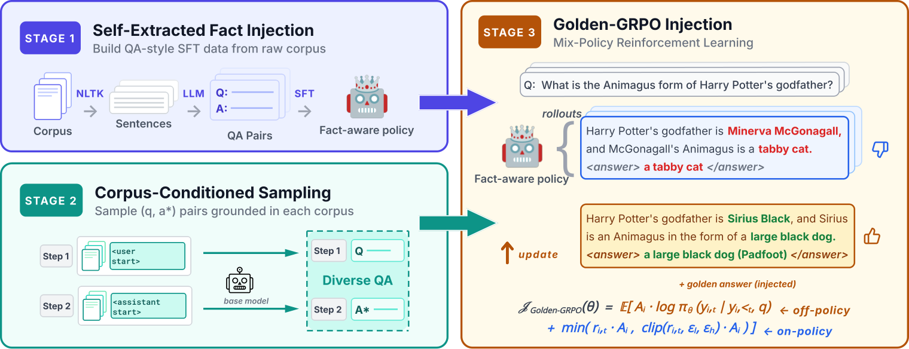

# GRIN：混合策略强化学习的持续知识吸收

> **复现级别：核心机制 mini-suite。** 真实执行论文特有的控制流/目标；未把确定性任务成功率当作论文 benchmark 复现。

## 论文信息

| 字段 | 内容 |
|---|---|
| 论文链接 | [arXiv 2608.25243](https://arxiv.org/abs/2608.25243) |
| 公司 / 机构 | University of California, Merced（第一作者第一署名单位） |
| 首次公开日期 | 2026-08-26（arXiv v1） |
| 原作者代码 | 否：未发现原作者公开代码（核查日期：2026-08-28） |
| 本地 adapter / 方法 | `grin` |
| 本地复现代码 | [`src/auto_research/post_training/latest_20260827.py`](https://github.com/daiwk/auto-research/blob/main/src/auto_research/post_training/latest_20260827.py) |

## 原始论文总结

### 背景与主要改动

纯 on-policy RL 在新知识尚未掌握时几乎采不到正确答案。GRIN 在失败组注入 golden response，再以 mixed-policy importance correction 训练；能力提高后自动回到 on-policy 探索。



<!-- paper-figure:start -->
### 原论文关键图

[](https://arxiv.org/html/2608.25243v1/bi8Au_arrow_border.png)

> **原论文 Figure 1（关键图）**：展示原论文提出的核心架构、主要模块及其连接关系。图片来自[原论文](https://arxiv.org/abs/2608.25243)，版权归原作者所有；点击图片可查看来源。
<!-- paper-figure:end -->

### 核心公式

$$
A(y)=\rho(y)\,[R(y)-b],\qquad \rho(y)=\frac{\pi_\theta(y|x)}{q_{mix}(y|x)}.
$$

### 论文离线与线上效果

Llama3.2-3B COUNTER 平均准确率 **43.65%**，fail@k **24.05%**；显著优于 SFT 和 mixed-policy baselines。无工业线上 A/B。

## 本地复现

> **本地对照口径**：arithmetic-smoke 100 steps，accuracy **0.1250 → 0.3438（+175.00%）**；golden answer 是本地候选 oracle。

指标见 [`metrics/grin-arithmetic-smoke-seed42.json`](metrics/grin-arithmetic-smoke-seed42.json)。 批次索引见 [`../../experiments/latest-20260827-seed42.json`](../../experiments/latest-20260827-seed42.json)。

```bash
auto-research post-train --algorithm grin --dataset arithmetic-smoke --steps 100 --seed 42 --offline
```

## 复现边界

本地 mini-suite 用公开、确定性的候选/计划任务隔离机制差异；论文 checkpoint、私有训练数据、外部服务和完整 benchmark 均未声称已复刻。
