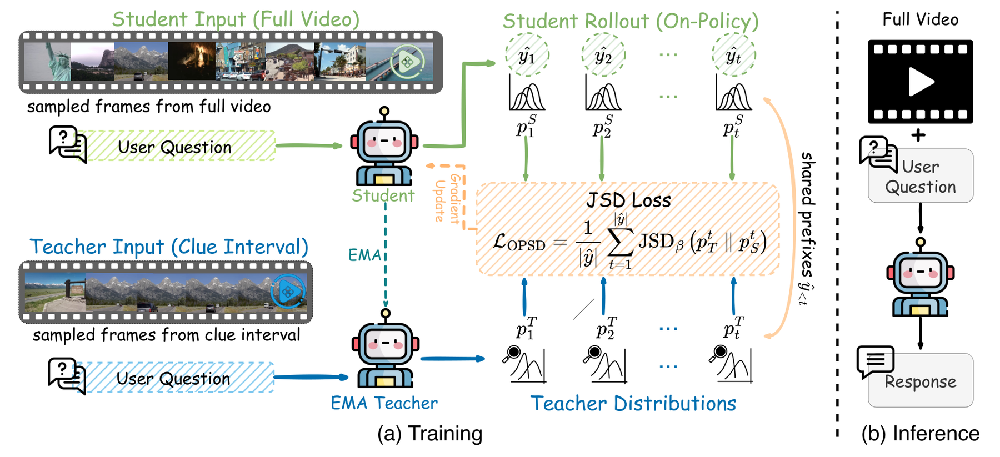

# Clue-OPSD：长视频 clue 特权视图蒸馏

> **复现级别：核心机制 mini-suite。** 真实执行论文特有的控制流/目标；未把确定性任务成功率当作论文 benchmark 复现。

## 论文信息

| 字段 | 内容 |
|---|---|
| 论文链接 | [arXiv 2608.25356](https://arxiv.org/abs/2608.25356) |
| 公司 / 机构 | University of Maryland, College Park / Johns Hopkins University（第一作者第一署名单位） |
| 首次公开日期 | 2026-08-26（arXiv v1） |
| 原作者代码 | 否：未发现原作者公开代码（核查日期：2026-08-28） |
| 本地 adapter / 方法 | `clue-opsd` |
| 本地复现代码 | [`src/auto_research/post_training/latest_20260827.py`](https://github.com/daiwk/auto-research/blob/main/src/auto_research/post_training/latest_20260827.py) |

## 原始论文总结

### 背景与主要改动

学生仍看完整长视频，冻结教师在训练时只看问题相关 clue interval；学生自己的 rollout 上做 on-policy self-distillation，推理时不需要 clue、标签或外部教师。


<!-- paper-figure:start -->
### 原论文关键图

[](https://arxiv.org/html/2608.25356v1/figure2_overall.png)

> **原论文 Figure 2（关键图）**：展示原论文的整体流程、关键阶段及其数据流向。图片来自[原论文](https://arxiv.org/abs/2608.25356)，版权归原作者所有；点击图片可查看来源。
<!-- paper-figure:end -->

### 核心公式

$$
\mathcal L_{OPSD}=\mathbb E_{y\sim\pi_\theta(\cdot|v,q)}\sum_t D_{KL}(\pi_T(\cdot|c,q,y_{<t})\Vert\pi_\theta(\cdot|v,q,y_{<t})).
$$

### 论文离线与线上效果

Qwen3.5-2B 在 MLVU/LVBench/LongVideoBench/MMVU 分别提升 **6.94/3.45/9.81/3.41 points**。无工业线上 A/B。

## 本地复现

> **本地对照口径**：arithmetic-smoke 100 steps，accuracy **0.1250 → 0.5938（+375.00%）**；clue 用 process-reward proxy 代替。

指标见 [`metrics/clue-opsd-arithmetic-smoke-seed42.json`](metrics/clue-opsd-arithmetic-smoke-seed42.json)。 批次索引见 [`../../experiments/latest-20260827-seed42.json`](../../experiments/latest-20260827-seed42.json)。

```bash
auto-research post-train --algorithm clue-opsd --dataset arithmetic-smoke --steps 100 --seed 42 --offline
```

## 复现边界

本地 mini-suite 用公开、确定性的候选/计划任务隔离机制差异；论文 checkpoint、私有训练数据、外部服务和完整 benchmark 均未声称已复刻。
