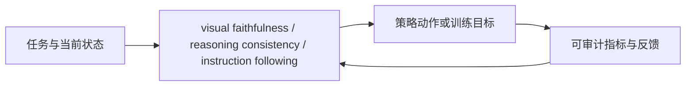
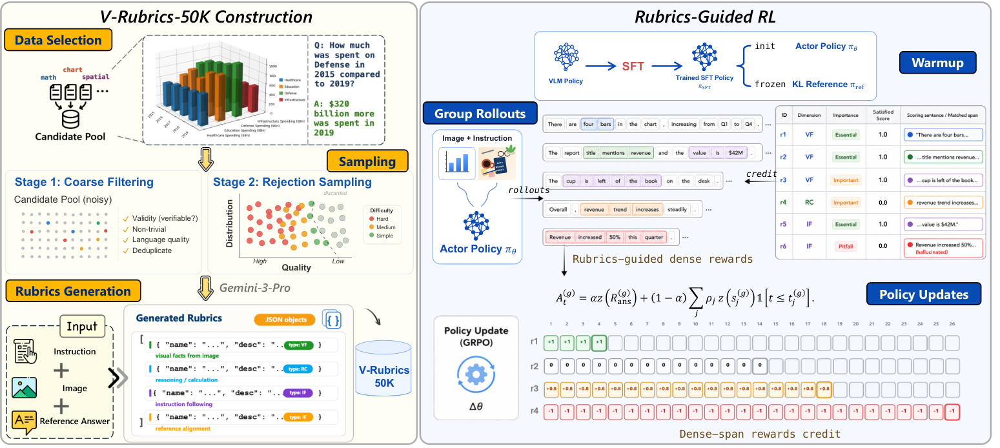

# V-Rubrics：多维视觉 rubric 的局部信用分配

> **复现级别：核心机制 mini-suite。** 真实执行论文特有的控制流/目标；未把确定性任务成功率当作论文 benchmark 复现。

## 论文信息

| 字段 | 内容 |
|---|---|
| 论文链接 | [arXiv 2608.25580](https://arxiv.org/abs/2608.25580) |
| 公司 / 机构 | S-Lab，南洋理工大学（第一作者第一署名单位） |
| 首次公开日期 | 2026-08-26（arXiv v1） |
| 原作者代码 | 是：[项目页](https://shulin16.github.io/v-rubrics/) |
| 本地 adapter / 方法 | `v-rubrics` |
| 本地复现代码 | [`src/auto_research/post_training/latest_20260827.py`](https://github.com/daiwk/auto-research/blob/main/src/auto_research/post_training/latest_20260827.py) |

## 原始论文总结

### 背景与主要改动

把参考回答拆成视觉忠实度（VF）、推理一致性（RC）和指令遵循（IF）原子 rubric，并把可定位证据的信用分配到前缀，避免终局标量奖励掩盖局部幻觉。



<!-- paper-figure:start -->
### 原论文关键图

[](https://arxiv.org/html/2608.25580v1/framework_overview.png)

> **原论文 Figure 2（关键图）**：展示原论文的训练流程与关键优化环节。图片来自[原论文](https://arxiv.org/abs/2608.25580)，版权归原作者所有；点击图片可查看来源。
<!-- paper-figure:end -->

### 核心公式

$$
R=0.45R_{VF}+0.35R_{RC}+0.20R_{IF},\qquad A_i=R_i-\bar R.
$$

### 论文离线与线上效果

相对 answer-only GRPO，总体平均再提升 **1.79 points**；视觉推理平均相对 SFT 提升 **4.00 points**。无工业线上 A/B。

## 本地复现

> **本地对照口径**：arithmetic-smoke 100 steps，accuracy **0.1250 → 0.2188（+75.00%）**；只验证多维、prefix-localized candidate credit。

指标见 [`metrics/v-rubrics-arithmetic-smoke-seed42.json`](metrics/v-rubrics-arithmetic-smoke-seed42.json)。 批次索引见 [`../../experiments/latest-20260827-seed42.json`](../../experiments/latest-20260827-seed42.json)。

```bash
auto-research post-train --algorithm v-rubrics --dataset arithmetic-smoke --steps 100 --seed 42 --offline
```

## 复现边界

本地 mini-suite 用公开、确定性的候选/计划任务隔离机制差异；论文 checkpoint、私有训练数据、外部服务和完整 benchmark 均未声称已复刻。
