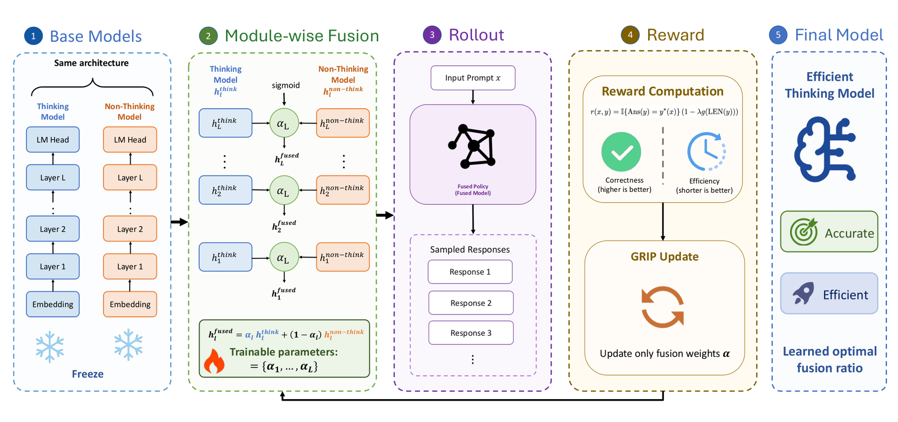

# GRIP：细粒度奖励引导的参数插值

> **复现级别：核心机制 mini-suite。** 真实执行论文特有的控制流/目标；未把确定性任务成功率当作论文 benchmark 复现。

## 论文信息

| 字段 | 内容 |
|---|---|
| 论文链接 | [arXiv 2608.25583](https://arxiv.org/abs/2608.25583) |
| 公司 / 机构 | Peking University（第一作者第一署名单位） |
| 首次公开日期 | 2026-08-26（arXiv v1） |
| 原作者代码 | 否：论文使用公开训练框架，但未发现方法专用原作者仓库（核查日期：2026-08-28） |
| 本地 adapter / 方法 | `grip` |
| 本地复现代码 | [`src/auto_research/post_training/latest_20260827.py`](https://github.com/daiwk/auto-research/blob/main/src/auto_research/post_training/latest_20260827.py) |

## 原始论文总结

### 背景与主要改动

在 thinking 与 instruct 权重间，不使用单一全局系数，而由细粒度 reward 学习分层/参数插值，使模型保留推理准确率同时缩短输出。


<!-- paper-figure:start -->
### 原论文关键图

[](https://arxiv.org/html/2608.25583v1/paper.png)

> **原论文 Figure 1（关键图）**：展示原论文方法的总体设计和关键组成。图片来自[原论文](https://arxiv.org/abs/2608.25583)，版权归原作者所有；点击图片可查看来源。
<!-- paper-figure:end -->

### 核心公式

$$
\theta_{GRIP}=\alpha(r)\odot\theta_{think}+[1-\alpha(r)]\odot\theta_{inst}.
$$

### 论文离线与线上效果

五个推理 benchmark 平均准确率 **76.5**，与 thinking 模型相当或更高，平均 token 使用量为其 **73.0%**。无工业线上 A/B。

## 本地复现

> **本地对照口径**：arithmetic-smoke 100 steps，accuracy **0.1250 → 0.2344（+87.50%）**；本地在策略概率而非大模型权重上验证 reward-guided interpolation。

指标见 [`metrics/grip-arithmetic-smoke-seed42.json`](metrics/grip-arithmetic-smoke-seed42.json)。 批次索引见 [`../../experiments/latest-20260827-seed42.json`](../../experiments/latest-20260827-seed42.json)。

```bash
auto-research post-train --algorithm grip --dataset arithmetic-smoke --steps 100 --seed 42 --offline
```

## 复现边界

本地 mini-suite 用公开、确定性的候选/计划任务隔离机制差异；论文 checkpoint、私有训练数据、外部服务和完整 benchmark 均未声称已复刻。
