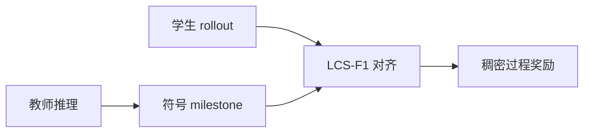
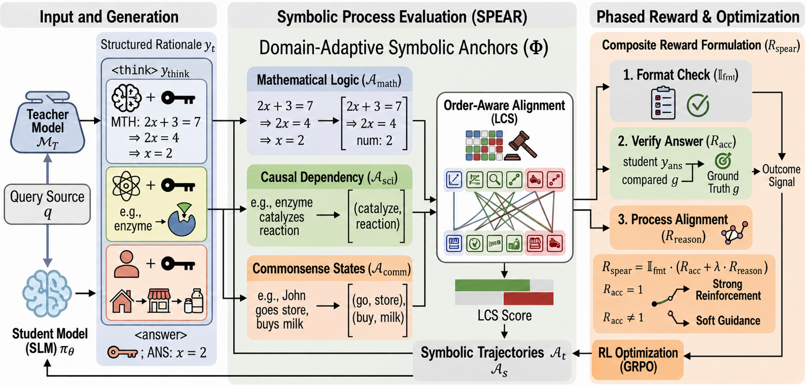

# SPEAR：符号推理骨架的顺序过程奖励

> **复现级别：核心机制 mini-suite。** 实现领域 milestone、顺序对齐与无神经 PRM 的稠密奖励。

## 论文信息

| 字段 | 内容 |
|---|---|
| 论文链接 | [arXiv 2608.26550](https://arxiv.org/abs/2608.26550) |
| 公司 / 机构 | University of Pittsburgh（第一作者第一署名单位） |
| 首次公开日期 | 2026-08-27（arXiv v1） |
| 原作者代码 | 是：[zhuochunli/SPEAR](https://github.com/zhuochunli/SPEAR) |
| 本地 adapter / 方法 | `spear` |
| 本地复现代码 | [`src/auto_research/post_training/latest_20260829.py`](https://github.com/daiwk/auto-research/blob/main/src/auto_research/post_training/latest_20260829.py) |

## 原始论文总结

### 背景与主要改动

结果奖励过稀，神经 PRM 又昂贵。SPEAR 把教师推理投影为领域符号 milestone，用 LCS-F1 给学生轨迹提供顺序敏感的稠密奖励。

<!-- paper-figure:start -->
### 原论文关键图

> **原论文 Figure 2（关键图）**：展示原论文提出的核心架构、主要模块及其连接关系。图片来自[原论文](https://arxiv.org/abs/2608.26550)，版权归原作者所有；点击图片可查看来源。
<!-- paper-figure:end -->

### 核心公式

$$
R_{SPEAR}=\frac{2P_{LCS}R_{LCS}}{P_{LCS}+R_{LCS}}.
$$

### 论文离线与线上效果

在数学、科学与常识推理上均改善学生蒸馏效果，并避免外部神经 verifier；无工业线上 A/B。

## 本地复现

arithmetic-smoke 100 steps：accuracy **0.1953 → 0.2812**，神经 PRM 调用数为 0。

指标见 [`metrics/arithmetic-smoke-seed42.json`](metrics/arithmetic-smoke-seed42.json)。批次索引见 [`../../experiments/latest-20260829-seed42.json`](../../experiments/latest-20260829-seed42.json)。

## 复现边界

本地 milestone 使用候选过程/格式轴，不等同论文的自然语言符号抽取器。
