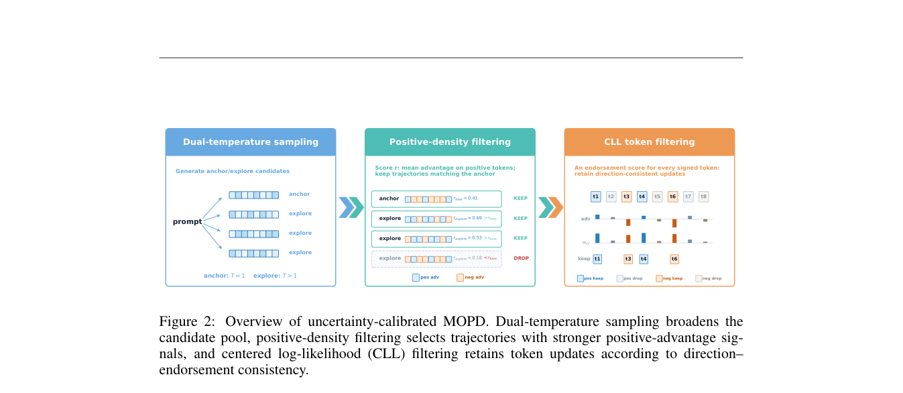

# Uncertainty-Calibrated MOPD：保留通用能力的多教师蒸馏

> **复现级别：核心机制 mini-suite。** 实现双温采样、正优势密度筛选和 centered log-likelihood 门控。

## 论文信息

| 字段 | 内容 |
|---|---|
| 论文链接 | [arXiv 2608.26735](https://arxiv.org/abs/2608.26735) |
| 公司 / 机构 | 北京大学（第一作者第一署名单位；工作完成于快手实习） |
| 首次公开日期 | 2026-08-27（arXiv v1） |
| 原作者代码 | 否：未发现原作者公开代码（核查日期：2026-08-29） |
| 本地 adapter / 方法 | `uc-mopd` |
| 本地复现代码 | [`src/auto_research/post_training/latest_20260829.py`](https://github.com/daiwk/auto-research/blob/main/src/auto_research/post_training/latest_20260829.py) |

## 原始论文总结

### 背景与主要改动

普通 MOPD 很少采到强正优势 token，也无法判断更新方向是否可靠。方法扩大温度覆盖，按轨迹正优势密度挑样本，再用熵校准 CLL 概率门控 token 更新。

<!-- paper-figure:start -->
### 原论文关键图

> **原论文 Figure 2（关键图）**：展示原论文方法的总体设计和关键组成。图片来自[原论文](https://arxiv.org/abs/2608.26735)，版权归原作者所有；点击图片可查看来源。
<!-- paper-figure:end -->

### 核心公式

$$
q_i=\sigma(\log p_T(y_i)-\mathbb E_v\log p_T(v)),\quad m_i\sim\mathrm{Bernoulli}(q_i).
$$

### 论文离线与线上效果

角色扮演与医疗专门化中，通用能力平均相对标准 MOPD 提升 **4.73% / 10.84%**，同时保持垂域性能。

## 本地复现

arithmetic-smoke 本轮 accuracy **0.1953 → 0.1953**。零提升被如实保留：机制运行正常，但单教师候选套件不能证明论文多教师收益。

指标见 [`metrics/arithmetic-smoke-seed42.json`](metrics/arithmetic-smoke-seed42.json)。批次索引见 [`../../experiments/latest-20260829-seed42.json`](../../experiments/latest-20260829-seed42.json)。

## 复现边界

未加载通用/垂域教师 checkpoint；本地结果仅证明筛选与随机门控控制流。
