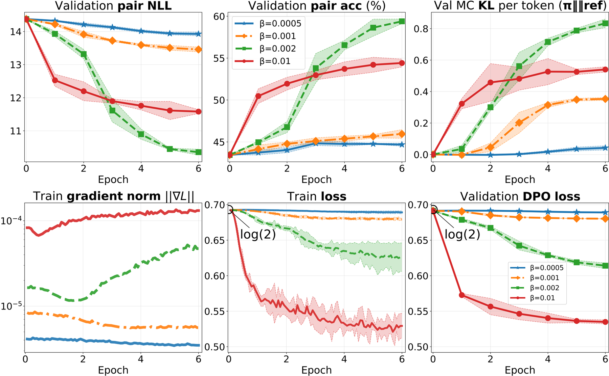

# Normalized DPO：解耦偏好尺度与优化尺度

> **复现级别：核心公式 mini-suite。** 实现 centered-softplus 归一化目标及连续的 $\beta\to0$ 极限。

## 论文信息

| 字段 | 内容 |
|---|---|
| 论文链接 | [arXiv 2608.27032](https://arxiv.org/abs/2608.27032) |
| 公司 / 机构 | Ivan Kruzhilov（论文未列机构） |
| 首次公开日期 | 2026-08-27（arXiv v1） |
| 原作者代码 | [已公开：bayesian_dpo](https://github.com/ivankru/bayesian_dpo) |
| 本地 adapter / 方法 | `normalized-dpo` |
| 本地复现代码 | [`src/auto_research/post_training/latest_20260831.py`](https://github.com/daiwk/auto-research/blob/main/src/auto_research/post_training/latest_20260831.py) |

## 原始论文总结

### 背景与主要改动

标准 DPO 的 $\beta$ 同时改变偏好噪声尺度与梯度幅度，导致有效学习率被隐式重缩放。论文用除以 $\beta$ 的 centered-softplus 保持相同 argmin，同时让梯度尺度在 $\beta\to0$ 时不消失。


<!-- paper-figure:start -->
### 原论文关键图

[](https://arxiv.org/html/2608.27032v1/images/hsteer_4b_standard_lr2e4_epoch6_nll_kl_grad_seed_mean.png)

> **原论文 Figure 1（关键图）**：展示原论文的训练流程与关键优化环节。图片来自[原论文](https://arxiv.org/abs/2608.27032)，版权归原作者所有；点击图片可查看来源。
<!-- paper-figure:end -->

### 核心公式

$$
\ell_{NDPO}(m;\beta)=\frac{\operatorname{softplus}(-\beta m)-\log2}{\beta},\quad
\frac{\partial\ell}{\partial m}=-\sigma(-\beta m).
$$

## 本地复现

arithmetic-smoke、100 steps：accuracy **0.1953 → 0.4766**，并记录 preference margin、normalized loss 与梯度力。指标见 [`metrics/arithmetic-smoke-seed42.json`](metrics/arithmetic-smoke-seed42.json)。

## 复现边界

本地为候选策略机制验证，不是语言模型偏好数据全量训练。

## 真实 checkpoint 训练路径

Normalized DPO 已接入统一的 causal-LM 训练器：固定 SmolLM2 与 UltraFeedback revision，保留冻结 reference，执行三次独立 checkpoint 更新，并统一比较 preference accuracy、margin 与 95% CI。

```bash
auto-research checkpoint-post-train --objective normalized-dpo \
  --dataset ultrafeedback --beta 0.1 --steps 40 \
  --maximum-examples 64 --evaluation-examples 24 --seeds 42,43,44
```

A100 验收使用公开数据小子集，确认 CUDA/bf16、冻结 reference、三种子、保存与指标路径均可执行；小子集没有准确率提升，因此不包装成正结果。
