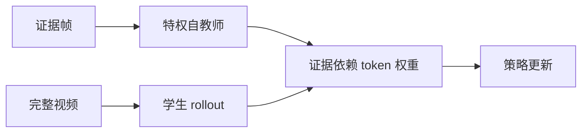
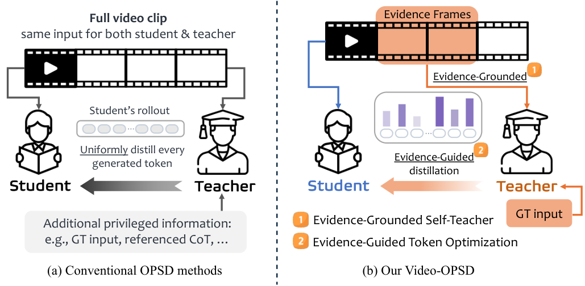

# Video-OPSD：证据帧特权自蒸馏

> **复现级别：核心机制 mini-suite。** 实现证据视图自教师与 evidence-guided token 权重。

## 论文信息

| 字段 | 内容 |
|---|---|
| 论文链接 | [arXiv 2608.27065](https://arxiv.org/abs/2608.27065) |
| 公司 / 机构 | 南洋理工大学（第一作者第一署名单位） |
| 首次公开日期 | 2026-08-27（arXiv v1） |
| 原作者代码 | 否：未发现原作者公开代码（核查日期：2026-08-31） |
| 本地 adapter / 方法 | `video-opsd` |
| 本地复现代码 | [`src/auto_research/post_training/latest_20260831.py`](https://github.com/daiwk/auto-research/blob/main/src/auto_research/post_training/latest_20260831.py) |

## 原始论文总结

### 背景与主要改动

学生读取完整视频，训练期自教师只读取人工标注的证据帧；再按 token 对证据的依赖度加权蒸馏。论文称效果接近 GRPO，而训练时间减少约 60%。



<!-- paper-figure:start -->
### 原论文关键图

[](https://arxiv.org/html/2608.27065v1/teaser.png)

> **原论文 Figure 1（关键图）**：展示原论文方法的总体设计和关键组成。图片来自[原论文](https://arxiv.org/abs/2608.27065)，版权归原作者所有；点击图片可查看来源。
<!-- paper-figure:end -->

### 核心公式

$$
\mathcal L_{EGO}=\sum_t w_t^{evidence}D_{KL}(p_T^t\Vert p_\theta^t).
$$

## 本地复现

arithmetic-smoke、100 steps：accuracy **0.1953 → 0.6562**，记录 evidence token weight 与 teacher gap。指标见 [`metrics/arithmetic-smoke-seed42.json`](metrics/arithmetic-smoke-seed42.json)。

## 复现边界

公开 smoke 数据没有视频帧，使用独立奖励轴模拟“证据依赖”；未训练 Video-LLM，不把概念验证写成论文指标复刻。

## 真实视频 checkpoint 路径

`auto-research video-opsd-eval` 在公开 Video-MME-v2 兼容数据上，用同一固定 SmolVLM2 checkpoint 和相同解码预算比较完整视频与 `evidence_frame_indices` 指定的特权证据视图，并报告三种子 accuracy、parse rate 与答案一致率：

```bash
auto-research video-opsd-eval --annotations video-mme-v2-evidence.jsonl \
  --video-root videos --seeds 42,43,44
```

该入口强制逐题证据帧标注，缺失即失败。它是公开 checkpoint 的证据视图审计，不宣称完成论文 6,500 条训练数据和 8×H100 的完整 OPSD 训练。
A100 验收使用 Video-MME-v2 固定 revision 的官方 demo 视频；仓库中的证据帧是额外协议标注，不是论文作者发布的 OPSD 标注。记录见 [Video-OPSD A100 receipt](../../gpu-validations/video-opsd-checkpoint-a100-20260901.json)。
