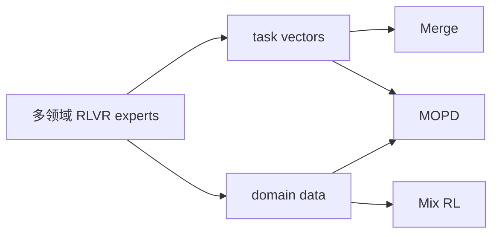
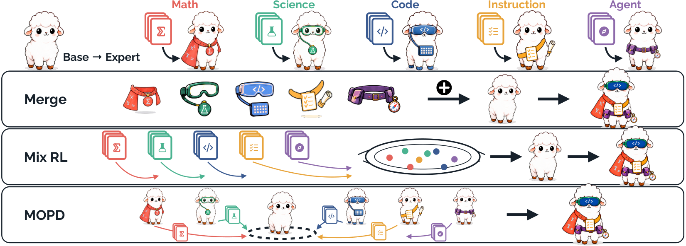

# RLVR Fusion：跨领域能力合并范式

> **复现级别：核心机制 mini-suite。** 公平实现论文三种范式的可审计诊断；本地已有领域专家时执行论文建议的 task-vector Merge，不把三者混成论文没有提出的新目标。

## 论文信息

| 字段 | 内容 |
|---|---|
| 论文链接 | [arXiv 2608.27409](https://arxiv.org/abs/2608.27409) |
| 公司 / 机构 | 复旦大学（第一作者第一署名单位）/ 腾讯 LLM Department |
| 首次公开日期 | 2026-08-27（arXiv v1） |
| 原作者代码 | [已公开：LLM-Fusion](https://github.com/Di-viner/LLM-Fusion) |
| 本地 adapter / 方法 | `rlvr-fusion` |
| 本地复现代码 | [`src/auto_research/post_training/latest_20260831.py`](https://github.com/daiwk/auto-research/blob/main/src/auto_research/post_training/latest_20260831.py) |

## 原始论文总结

### 背景与主要改动

论文统一比较三种复用产物不同的跨域能力融合：Merge 合并专家 task vector，Mix RL 合并训练数据，MOPD 同时复用专家和数据。平均差距不超过 1.4 points，但单项可达 8.6 points，因此选择取决于专家、数据和成本条件。

<!-- paper-figure:start -->
### 原论文关键图

> **原论文 Figure 1（关键图）**：展示原论文方法的总体设计和关键组成。图片来自[原论文](https://arxiv.org/abs/2608.27409)，版权归原作者所有；点击图片可查看来源。
<!-- paper-figure:end -->

### 核心公式

$$
\tau_i=\theta_i-\theta_0,\qquad \theta_{merge}=\theta_0+\frac1K\sum_i\tau_i.
$$

## 本地复现

arithmetic-smoke、100 steps：accuracy **0.1953 → 0.2812**；同时记录 task-vector cosine、Mix RL advantage 和 MOPD teacher-gap 诊断。指标见 [`metrics/arithmetic-smoke-seed42.json`](metrics/arithmetic-smoke-seed42.json)。

## 复现边界

本地候选策略不是大模型 checkpoint；只执行“已有 experts”条件下的 Merge，Mix RL/MOPD 作为等预算可审计诊断，不声称复刻论文多模型规模结果。
