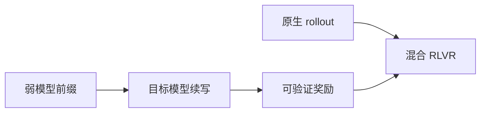
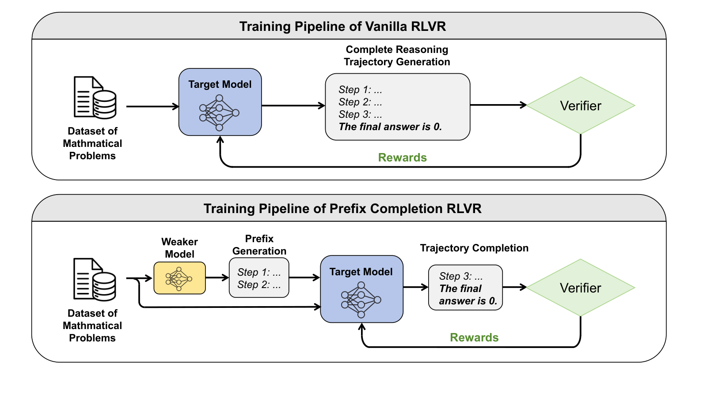

# Weak-Model Guidance：用弱模型前缀恢复 RLVR 探索

> **复现级别：核心机制 mini-suite。** 实现跨模型前缀扰动、混合采样与 entropy 诊断。

## 论文信息

| 字段 | 内容 |
|---|---|
| 论文链接 | [arXiv 2608.27420](https://arxiv.org/abs/2608.27420) |
| 公司 / 机构 | 北京大学王选计算机研究所（第一作者第一署名单位） |
| 首次公开日期 | 2026-08-27（arXiv v1） |
| 原作者代码 | 否：未发现原作者公开代码（核查日期：2026-08-29） |
| 本地 adapter / 方法 | `weak-guide-rlvr` |
| 本地复现代码 | [`src/auto_research/post_training/latest_20260829.py`](https://github.com/daiwk/auto-research/blob/main/src/auto_research/post_training/latest_20260829.py) |

## 原始论文总结

### 背景与主要改动

RLVR 容易熵坍缩。论文用更小弱模型生成部分推理前缀，迫使目标模型进入陌生轨迹，再以 entropy 截断和原生/前缀样本混训保持覆盖率。

<!-- paper-figure:start -->
### 原论文关键图

> **原论文 Figure 2（关键图）**：展示原论文提出的核心架构、主要模块及其连接关系。图片来自[原论文](https://arxiv.org/abs/2608.27420)，版权归原作者所有；点击图片可查看来源。
<!-- paper-figure:end -->

### 核心公式

$$
p_{mix}(y\mid x)=\rho p_\theta(y\mid x,z_{weak})+(1-\rho)p_\theta(y\mid x).
$$

### 论文离线与线上效果

多个数学 benchmark 均超过 vanilla RLVR，且 $k$ 越大 pass@$k$ 增益越明显；论文未报告工业线上 A/B。

## 本地复现

arithmetic-smoke 100 steps：accuracy **0.1953 → 0.6797**，并记录 guided entropy 与 prefix surprise。

指标见 [`metrics/arithmetic-smoke-seed42.json`](metrics/arithmetic-smoke-seed42.json)。批次索引见 [`../../experiments/latest-20260829-seed42.json`](../../experiments/latest-20260829-seed42.json)。

## 复现边界

弱教师由冻结 reference 分布模拟；未声称完成双 checkpoint RLVR。
