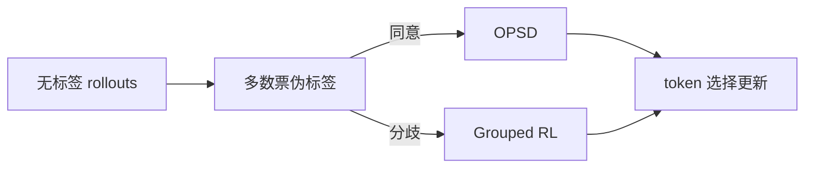
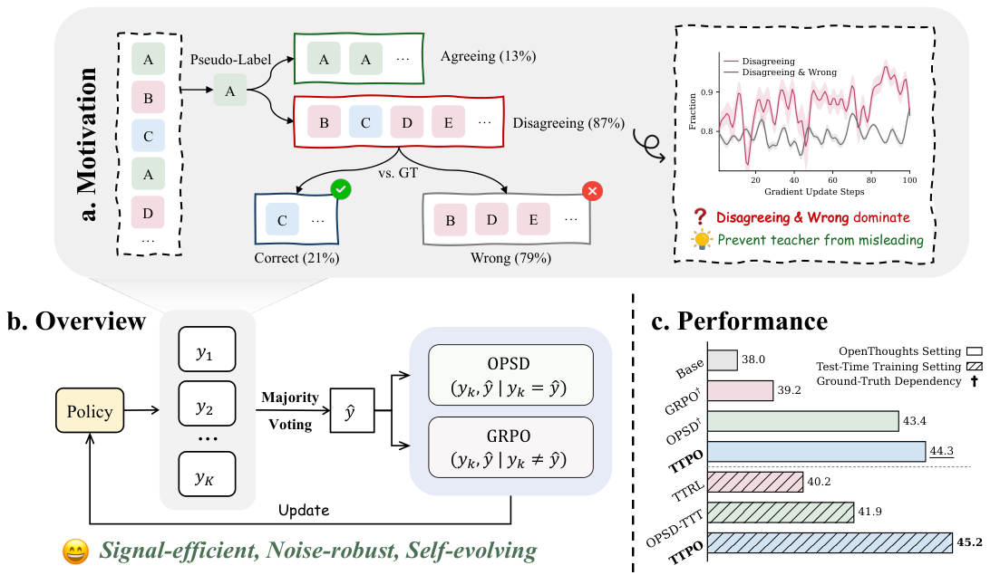

# TTPO：无标签测试时策略优化

> **复现级别：核心机制 mini-suite。** 实现多数票路由、同意样本 OPSD、分歧样本 grouped RL 与置信错误筛选。

## 论文信息

| 字段 | 内容 |
|---|---|
| 论文链接 | [arXiv 2608.27448](https://arxiv.org/abs/2608.27448) |
| 公司 / 机构 | 浙江大学（第一作者第一署名单位），与阿里巴巴合作 |
| 首次公开日期 | 2026-08-27（arXiv v1） |
| 原作者代码 | 是：[ZJU-REAL/TTPO](https://github.com/ZJU-REAL/TTPO) |
| 本地 adapter / 方法 | `ttpo` |
| 本地复现代码 | [`src/auto_research/post_training/latest_20260829.py`](https://github.com/daiwk/auto-research/blob/main/src/auto_research/post_training/latest_20260829.py) |

## 原始论文总结

### 背景与主要改动

多数票伪标签可能错误，但与多数票分歧的 rollout 通常仍是错的。TTPO 因而对同意分支做 OPSD，对分歧分支做 grouped RL，并分别过滤已收敛 token 与高置信错误。



<!-- paper-figure:start -->
### 原论文关键图

[](https://arxiv.org/html/2608.27448v1/intro.png)

> **原论文 Figure 1（关键图）**：展示原论文方法的总体设计和关键组成。图片来自[原论文](https://arxiv.org/abs/2608.27448)，版权归原作者所有；点击图片可查看来源。
<!-- paper-figure:end -->

### 核心公式

$$
\mathcal L=\mathbf1[a=\hat a]\mathcal L_{OPSD}+\lambda\mathbf1[a\ne\hat a]\mathcal L_{GRL}.
$$

### 论文离线与线上效果

Qwen3-1.7B 测试时训练平均从 **38.0% 提升到 45.2%**；无 thinking 设置提升 **25.2%–36.4%**。

## 本地复现

arithmetic-smoke 100 steps：accuracy **0.1953 → 0.6328**。这是候选策略上的机制隔离，不等同论文数学 benchmark。

指标见 [`metrics/arithmetic-smoke-seed42.json`](metrics/arithmetic-smoke-seed42.json)。批次索引见 [`../../experiments/latest-20260829-seed42.json`](../../experiments/latest-20260829-seed42.json)。

```bash
auto-research post-train --algorithm ttpo --dataset arithmetic-smoke --steps 100 --seed 42 --offline
```

## 复现边界

未加载 Qwen checkpoint、未执行真实 test-time rollout；只验证非对称目标和 token 选择路径。
