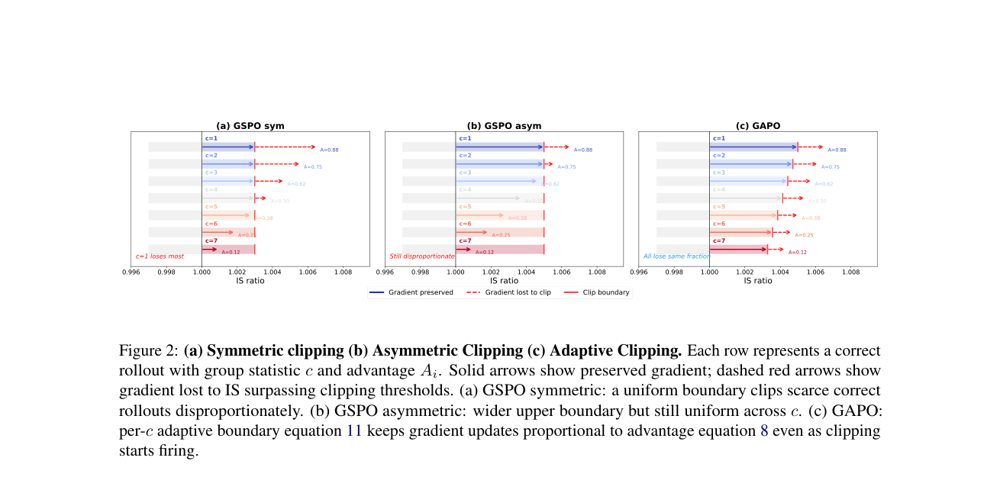

# GAPO：按困难度自适应保留稀有正确轨迹

> **复现级别：核心目标函数 mini-suite。** 在统一 group-relative runner 中实现论文的逐组自适应上裁剪边界。

## 论文信息

| 字段 | 内容 |
|---|---|
| 论文链接 | [arXiv 2609.00444](https://arxiv.org/abs/2609.00444) |
| 公司 / 机构 | University of Toronto / Amazon（第一作者署名单位） |
| 首次公开日期 | 2026-08-31（arXiv v1） |
| 原作者代码 | 是：[Sheng-J/GAPO](https://github.com/Sheng-J/GAPO) |
| 本地 adapter / 方法 | `gapo` |
| 本地复现代码 | [`src/auto_research/post_training/latest_20260905.py`](https://github.com/daiwk/auto-research/blob/main/src/auto_research/post_training/latest_20260905.py) |

## 原始论文总结

### 背景与主要改动

固定 PPO/GSPO clip 会同等截断简单题和困难题，却让困难题中少见的正确 rollout 更早失去梯度。GAPO 不改 reward 或 advantage，只根据一组 k 条 rollout 中的正确数 c 调整正优势的上裁剪宽度。

```mermaid
flowchart LR
  R[k 条 rollout] --> C[统计正确数 c]
  C --> E[自适应 epsilon_hi(c)]
  R --> A[组相对 advantage]
  E --> L[GSPO/PPO clipped loss]
  A --> L
```

<!-- paper-figure:start -->
### 原论文关键图

[](https://arxiv.org/pdf/2609.00444#page=3)

> **原论文 Figure 2（关键图）**：展示原论文方法的总体设计和关键组成。图片来自[原论文](https://arxiv.org/abs/2609.00444)，版权归原作者所有；点击图片可查看来源。
<!-- paper-figure:end -->

### 核心公式

$$
\epsilon_{hi}(c)=\epsilon_{lo}+(\epsilon_{hi}^{max}-\epsilon_{lo})\frac{k-c}{k-1}.
$$

### 论文离线与线上效果

论文在 Qwen、Llama 的数学与代码 RLVR 上同时改善 Pass@1 和 Pass@k。

## 本地复现

`arithmetic-smoke`、100 steps、seeds 42/43/44 的逐轮 `group_correct_count`、`adaptive_upper_clip`、clip fraction 和准确率记录见 [`metrics/arithmetic-smoke-seeds42-44.json`](metrics/arithmetic-smoke-seeds42-44.json)。

## 复现边界

本地是 NumPy 策略分布 mini-suite，并非 Qwen/Llama 全参数 RLVR；未宣传 CUDA 路径，因此无需 GPU receipt。
