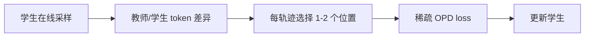
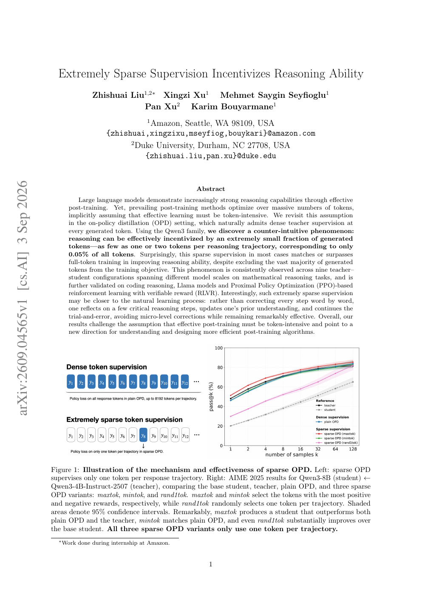

# Sparse OPD：每条推理轨迹只监督一两个关键 token

> **复现级别：核心目标函数 mini-suite。** 在统一 OPD runner 中实现最大差异、最小差异和随机稀疏 token 选择。

## 论文信息

| 字段 | 内容 |
|---|---|
| 论文链接 | [arXiv 2609.04565](https://arxiv.org/abs/2609.04565) |
| 公司/机构 | Amazon / Duke University（第一作者署名单位；工作完成于 Amazon 实习） |
| 首次公开日期 | 2026-09-03（arXiv v1） |
| 原文开源代码 | 否：未找到公开代码仓库（核查日期：2026-09-07） |
| Adapter / 方法 | `sparse-opd` |
| 本地复现代码 | [`src/auto_research/post_training/latest_20260907.py`](https://github.com/daiwk/auto-research/blob/main/src/auto_research/post_training/latest_20260907.py) |

## 原始论文总结

### 背景与主要改动

常规 on-policy distillation 对生成轨迹的每个 token 使用教师分布。论文发现只挑一到两个关键位置、约占全部 token 的 0.05%，也能达到或超过全 token 训练。最大正差异 token 尤其有效，说明有效后训练可能更接近“反思关键步骤”而非逐字纠错。

<!-- paper-figure:start -->
### 原论文关键图

> **原论文 Figure 1（关键图）**：比较 dense OPD 与一 token 稀疏监督，并给出 AIME 结果。图片来自[原论文](https://arxiv.org/abs/2609.04565)，版权归原作者所有。
<!-- paper-figure:end -->

### 核心公式

对学生轨迹 $y$，先计算每个位置的教师—学生差异 $d_t$，再取 $S_k=\operatorname{TopK}_t(d_t)$，优化 $\mathcal L=-|S_k|^{-1}\sum_{t\in S_k}\log p_T(y_t|y_{<t})/p_\theta(y_t|y_{<t})$。

### 论文离线与线上效果

论文在九种 Qwen3 教师—学生组合、数学与代码推理、Llama 和 PPO-RLVR 上验证；单 token `maxtok` 在示例配置中超过 dense OPD 与教师。

## 本地复现

`arithmetic-smoke`、seeds 42/43/44 的监督位置数、监督比例、选择差异和目标值见 [`metrics/arithmetic-smoke-seeds42-44.json`](metrics/arithmetic-smoke-seeds42-44.json)。

> **本地对照口径**：本地仅验证稀疏位置选择和 loss 掩码，不把 NumPy mini-suite 准确率等同于 AIME/LiveCodeBench。

## 复现边界

未执行 Qwen/Llama 全参数 OPD 或 PPO；当前方法不宣传 CUDA 路径，因此无需 GPU receipt。
