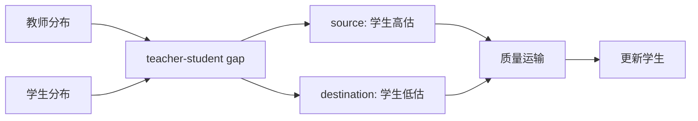
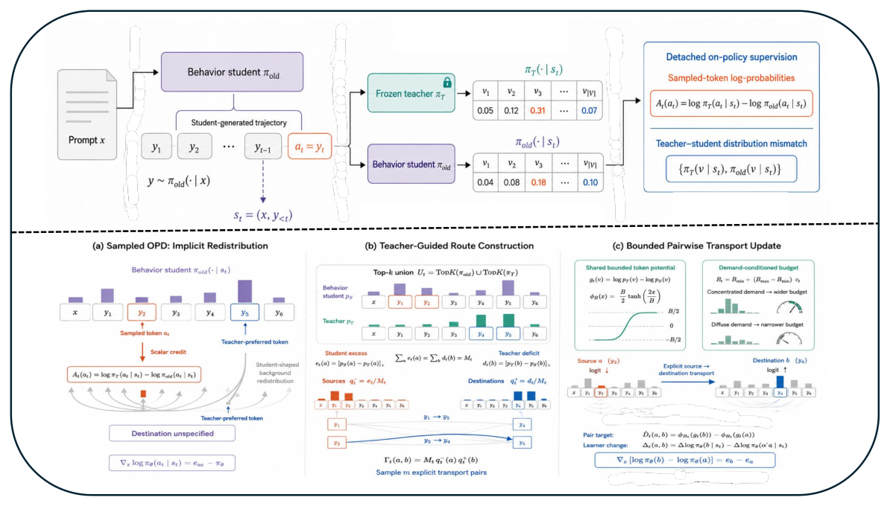

# RouteOPD：把教师概率质量显式路由给学生

> **复现级别：候选策略机制诊断。** 执行 source-to-destination 概率质量运输，不声称复现大模型推理能力。

## 论文信息

| 字段 | 内容 |
|---|---|
| 论文链接 | [arXiv 2609.08337](https://arxiv.org/abs/2609.08337) |
| 公司/机构 | Tencent（第一作者署名单位） |
| 首次公开日期 | 2026-09-08（arXiv v1） |
| 原文开源代码 | 否：未找到作者公开仓库（核查日期：2026-09-12） |
| Adapter / 方法 | `route-opd` |
| 本地复现代码 | [`src/auto_research/post_training/latest_20260912.py`](https://github.com/daiwk/auto-research/blob/main/src/auto_research/post_training/latest_20260912.py) |

## 原始论文总结

### 背景与主要改动

普通 OPD 对整个教师分布做密集匹配。RouteOPD 先识别学生高估的 source token 和低估的 destination token，再只搬运需要修正的概率质量，使监督更聚焦且可解释。

<!-- paper-figure:start -->
### 原论文关键图

> **原论文 Figure 2（关键图）**：展示原论文方法的总体设计和关键组成。图片来自[原论文](https://arxiv.org/abs/2609.08337)，版权归原作者所有；点击图片可查看来源。
<!-- paper-figure:end -->

### 核心机制

本地按 $s_i=[p_S(i)-p_T(i)]_+$ 和 $d_j=[p_T(j)-p_S(j)]_+$ 构造供给与需求，在两者之间运输 $\min(\sum_i s_i,\sum_j d_j)$ 的质量，并记录 `transported_mass`。

## 本地复现与边界

三种子结果见 [`metrics/arithmetic-smoke-seeds42-44.json`](metrics/arithmetic-smoke-seeds42-44.json)。未执行原论文全参数模型、真实 rollout 或公开推理 benchmark；结果只证明路由算子执行且数值有限。
