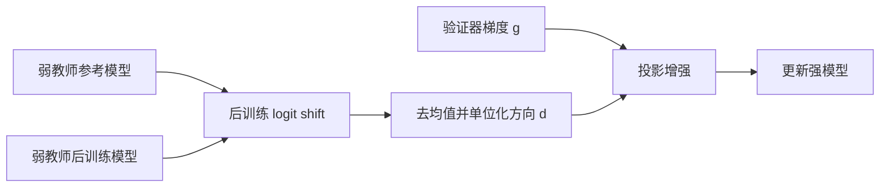
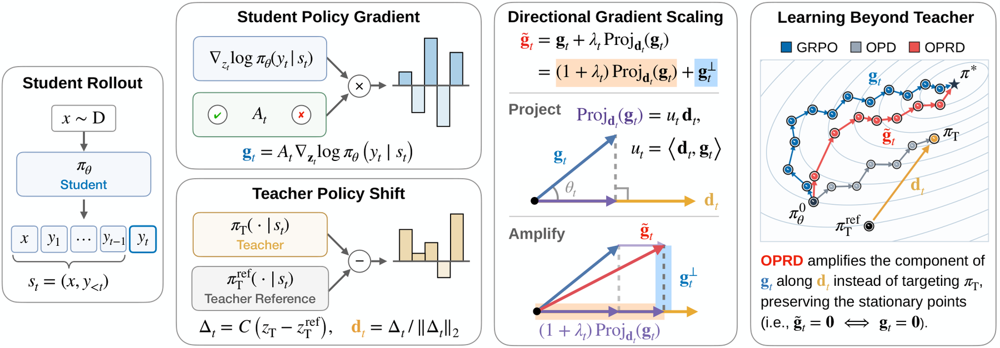

# OPRD：用弱模型的学习方向增强验证器梯度

> **复现级别：候选策略机制诊断。** 实现论文的反向蒸馏方向提取与验证器梯度投影，不把小型分类策略的结果等同于完整 LLM 后训练。

## 论文信息

| 字段 | 内容 |
|---|---|
| 论文链接 | [arXiv 2609.08798](https://arxiv.org/abs/2609.08798) |
| 公司/机构 | KAIST AI（第一作者署名单位） |
| 首次公开日期 | 2026-09-08（arXiv v1） |
| 原文开源代码 | 否：未找到作者公开仓库（核查日期：2026-09-12） |
| Adapter / 方法 | `oprd` |
| 本地复现代码 | [`src/auto_research/post_training/latest_20260912.py`](https://github.com/daiwk/auto-research/blob/main/src/auto_research/post_training/latest_20260912.py) |

## 原始论文总结

### 背景与主要改动

OPRD 不直接模仿弱教师答案，而是先测量弱教师经过后训练后的 logit 变化方向，再沿这个方向增强强模型的可验证奖励梯度；核心假设是“学习方向”比弱模型最终能力更容易迁移。

<!-- paper-figure:start -->
### 原论文关键图

> **原论文 Figure 2（关键图）**：展示原论文的训练流程与关键优化环节。图片来自[原论文](https://arxiv.org/abs/2609.08798)，版权归原作者所有；点击图片可查看来源。
<!-- paper-figure:end -->

### 核心公式

令 $d=\operatorname{normalize}((z_{W_1}-z_{W_0})-\operatorname{mean}(z_{W_1}-z_{W_0}))$，论文增强后的验证器梯度为 $g'=(I+\lambda dd^\top)g$。本地实现逐候选计算该投影，再通过特征映射回策略参数。

### 论文效果

论文报告达到同等性能所需更新数减少 33%–67%，早期训练最多提升 22.7 个百分点，多教师设置减少约 55% 更新。以上均为论文结果，不是本地 NumPy 指标。

## 本地复现与边界

三种子结果见 [`metrics/arithmetic-smoke-seeds42-44.json`](metrics/arithmetic-smoke-seeds42-44.json)。本地仅验证方向提取和 $(I+\lambda dd^\top)g$ 的可执行性；候选集合来自带标签的诊断任务，故 `diagnostic_only=true`、不可晋升为能力证据。
