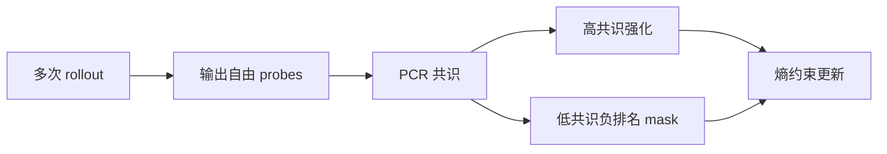
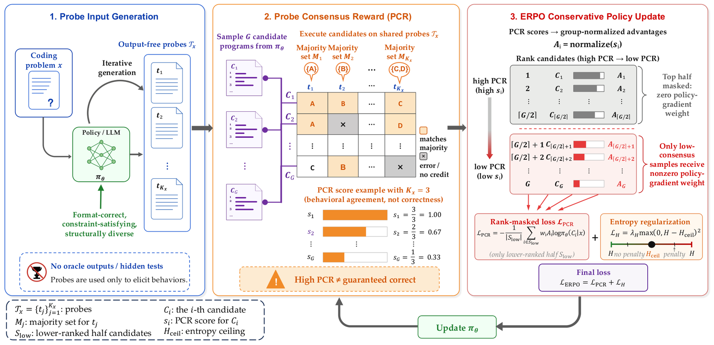

# Probe-ERPO：用输出自由探针决定测试时强化方向

> **复现级别：PCR 已知条件下的策略更新诊断。** 本地不执行论文的代码探针，只验证 PCR 分组后的负排名掩码与熵方向。

## 论文信息

| 字段 | 内容 |
|---|---|
| 论文链接 | [arXiv 2609.09135](https://arxiv.org/abs/2609.09135) |
| 公司/机构 | Nanyang Technological University（第一作者署名单位） |
| 首次公开日期 | 2026-09-08（arXiv v1） |
| 原文开源代码 | 否：未找到作者公开仓库（核查日期：2026-09-12） |
| Adapter / 方法 | `probe-erpo` |
| 本地复现代码 | [`src/auto_research/post_training/latest_20260912.py`](https://github.com/daiwk/auto-research/blob/main/src/auto_research/post_training/latest_20260912.py) |

## 原始论文总结

### 背景与主要改动

论文用不依赖最终答案的 probe consistency ratio（PCR）估计当前题目的可信度：高一致样本可强化，低一致样本对排名靠后的候选施加负向约束，同时用熵项控制探索。

<!-- paper-figure:start -->
### 原论文关键图

> **原论文 Figure 2（关键图）**：展示原论文方法的总体设计和关键组成。图片来自[原论文](https://arxiv.org/abs/2609.09135)，版权归原作者所有；点击图片可查看来源。
<!-- paper-figure:end -->

## 本地复现与边界

三种子结果见 [`metrics/arithmetic-smoke-seeds42-44.json`](metrics/arithmetic-smoke-seeds42-44.json)。诊断 fixture 提供 PCR 轴，本地实现低共识候选的负排名 mask 和 entropy direction；没有运行代码执行探针，所以不可把该结果称为完整 TTRL/ERPO。
