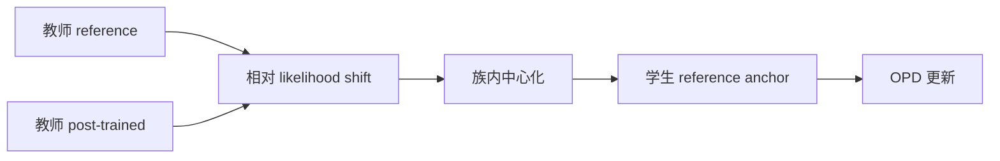
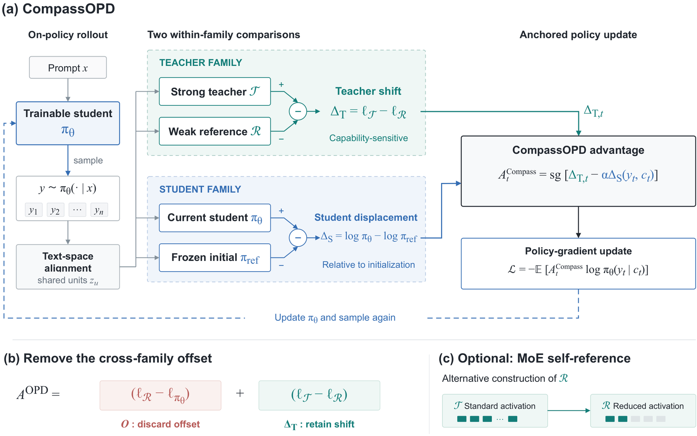

# CompassOPD：跨模型族对齐教师的相对方向

> **复现级别：候选策略机制诊断。** 实现去除 family offset 的教师方向，不冒充跨 tokenizer 的完整 LLM 训练。

## 论文信息

| 字段 | 内容 |
|---|---|
| 论文链接 | [arXiv 2609.10154](https://arxiv.org/abs/2609.10154) |
| 公司/机构 | 中国科学院信息工程研究所（第一作者署名单位） |
| 首次公开日期 | 2026-09-09（arXiv v1） |
| 原文开源代码 | 否：未找到作者公开仓库（核查日期：2026-09-12） |
| Adapter / 方法 | `compass-opd` |
| 本地复现代码 | [`src/auto_research/post_training/latest_20260912.py`](https://github.com/daiwk/auto-research/blob/main/src/auto_research/post_training/latest_20260912.py) |

## 原始论文总结

### 背景与主要改动

异构教师与学生的绝对概率刻度不可直接比较。CompassOPD 用教师相对其 reference 的后训练变化作“指南针”，并在模型族内中心化，保留方向而消除不同模型族的整体偏置。

<!-- paper-figure:start -->
### 原论文关键图

> **原论文 Figure 2（关键图）**：展示原论文方法的总体设计和关键组成。图片来自[原论文](https://arxiv.org/abs/2609.10154)，版权归原作者所有；点击图片可查看来源。
<!-- paper-figure:end -->

### 核心机制

本地计算教师变化 $\Delta=z_{T_1}-z_{T_0}$，再用 $\Delta-\mathbb E[\Delta]$ 构造跨族可比方向；`centered_cross_family_gap` 审计中心化后的实际修正幅度。

## 本地复现与边界

三种子结果见 [`metrics/arithmetic-smoke-seeds42-44.json`](metrics/arithmetic-smoke-seeds42-44.json)。当前候选共享同一有限动作空间，未复刻跨 tokenizer 映射和全参数训练，因此属于 L1 机制诊断。
