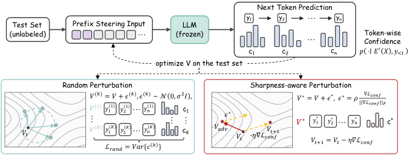

# Beyond Confidence: Stability-Aware Test-Time Adaptation for LLM Reasoning

> **复现级别：L1 核心机制诊断。** 本地执行随机邻域扰动和稳定性惩罚；没有加载冻结 LLM prefix。

## 论文信息

| 字段 | 内容 |
|---|---|
| 论文链接 | [Beyond Confidence: Stability-Aware Test-Time Adaptation for LLM Reasoning](https://arxiv.org/abs/2609.11393) |
| 公司/机构 | Chongqing University（按第一作者署名单位） |
| 首次公开日期 | 2026-09-10 |
| 原文开源代码 | 否：未找到作者公开仓库（核查日期：2026-09-14） |
| Adapter / 方法 | `tasco` |
| 本地复现代码 | [`src/auto_research/post_training/latest_20260914.py`](https://github.com/daiwk/auto-research/blob/main/src/auto_research/post_training/latest_20260914.py) |

## 原始论文总结

### 背景与主要改动

冻结主模型，优化轻量 prefix；除置信度外还惩罚邻域扰动下的不稳定，从而避免自信但错误的轨迹。

<!-- paper-figure:start -->
### 原论文关键图

> **原论文 Figure 3（关键图）**：展示原论文方法的总体设计和关键组成。图片来自[原论文](https://arxiv.org/abs/2609.11393)，版权归原作者所有；点击图片可查看来源。
<!-- paper-figure:end -->

### 核心公式或操作

本地代码把论文决定性操作实现为确定性的 reference kernel，并显式输出门控、选择、投影、图边或状态更新统计；测试覆盖公式不变量和边界条件。

### 论文离线与线上效果

推理准确率最高提升 17.2%，输出 token 最多减少 28.1%。 这些数字来自原论文，不与本地缩小实验直接比较；论文未报告线上 A/B 时不推断线上收益。

## 本地复现

三种子指标见 [`metrics/mechanism-seeds42-44.json`](metrics/mechanism-seeds42-44.json)。所有候选使用相同公开 fixture、预算和 seed；本页结果只证明核心状态转换实际执行。

### 复现边界

本地执行随机邻域扰动和稳定性惩罚；没有加载冻结 LLM prefix。
