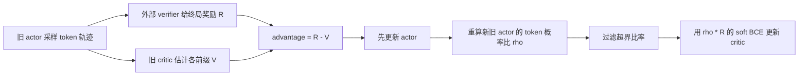
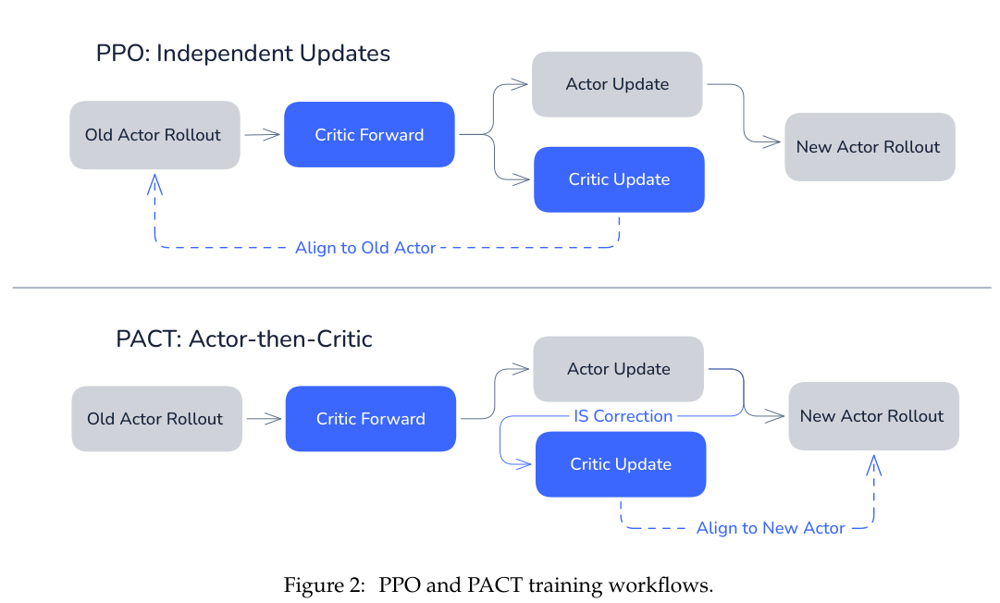

# PACT：从 token 信用分配到策略对齐的 critic

> 以真实自由生成轨迹验证 Actor-then-Critic、更新后策略的重要性校正与概率 critic；本地结果不是原论文大模型成绩。

## 论文信息

| 字段 | 内容 |
|---|---|
| 论文链接 | [PACT: From Credit Assignment to Critic Alignment](https://arxiv.org/abs/2609.26355) |
| 公司 / 机构 | AllSpark Team（论文署名；未逐一列出一作机构） |
| 首次公开日期 | 2026-09-22（arXiv v1） |
| 原作者代码 | [项目仓库](https://github.com/AllSpark-Research/PACT)已创建，但截至 2026-09-27 为空；训练源码未发布 |
| 本地 adapter / CLI key | `pact` |
| 本地复现代码 | `src/auto_research/post_training/pact.py`、`src/auto_research/post_training/generation.py` |

## 原始论文总结

### 背景与主要改动

终局奖励只有一个标量，但 actor 要更新每个生成 token。论文在完整性、前缀一致性和中性三个条件下，刻画 token 的理论信用为相邻前缀的条件期望之差。实际训练无法精确知道这些期望，因此用概率 critic 估计前缀价值，令 token advantage 近似为 `R − V(prefix)`。



论文的关键是**顺序**：critic 应逼近 actor 更新后的策略，而不是只拟合刚采样时的旧策略。实用版本用当前 token 的概率比 `ρ_t`，而非整个未来序列的比率乘积；这是一阶近似，并非精确的 continuation importance sampling。

<!-- paper-figure:start -->
### 原论文关键图

[](https://arxiv.org/pdf/2609.26355#page=7)

> **原论文 Figure 2（关键图）**：展示原论文方法的总体设计和关键组成。图片来自[原论文](https://arxiv.org/abs/2609.26355)，版权归原作者所有；点击图片可查看来源。
<!-- paper-figure:end -->

### 核心公式

$$
\rho_t = \exp\!\left(\log\pi_{\rm new}(y_t\mid x,y_{<t})-\log\pi_{\rm old}(y_t\mid x,y_{<t})\right),
\qquad Y_t=\rho_t R.
$$

critic logit `z_t` 的目标写为 `softplus(z_t) − Y_t z_t`。单个 `Y_t` 可能大于 1，不能直接交给假定 target 在 `[0,1]` 内的常规 BCE API。实现仅接受论文设定区间内的 token 比率，再对接受的 token 求平均。

### 论文离线与线上效果

原文使用 Qwen3.5-4B 做数学推理、Qwen3.6-35B-A3B 做 SWE-bench Verified；报告四个数学基准平均准确率 72.87%、SWE-bench Verified pass@1 为 67.4%。这些是论文结果，**不是本仓库复现出的指标**。

## 本地复现

本地使用小型 GRU 因果语言模型、独立前缀 critic、无约束 token 自由生成与 exact-answer verifier。初始策略会用 **train split 的参考解答做监督预热**，并由训练文本建立字符词表；进入 PACT 更新后，actor 只接收 train prompt 和自行采样的 token，gold answer 仅供外部 verifier 计算奖励，绝不喂给该阶段的策略或 critic。validation/test 保持分离。Actor 使用论文允许的 PPO clipped update 变体，接着以更新后 actor 对 rollout actor 的 token 比率训练 critic。

```bash
auto-research post-train --algorithm pact --dataset arithmetic-generate \
  --maximum-examples 48 --steps 3 --group-size 2 --seeds 42,43,44 \
  --offline --device cpu --cpu-threads 2
```

本地三种子（42/43/44）短预算验证：validation exact accuracy 由 `0.0000` 到 `0.0069 ± 0.0098`，mean verifier reward 由 `0.1000` 到 `0.1056`。基线准确率为零，因此相对提升百分比**不适用**；绝对变化也不足以支持能力提升结论。每轮均记录 critic 接受比例、更新后的 token 概率比与 critic loss，测试断言 actor 与 critic 参数都实际改变。

可复核的命令、种子、数据指纹和结果见[本地实验记录](../../experiments/pact-arithmetic-seeds42-44.json)。

## 复现边界

这验证了 PACT 的更新次序与损失路径，但没有复现 4B/35B checkpoint、agentic 工具环境、原文训练规模或原文基准成绩；应作为小模型机制证据，不据此宣称 LLM 能力提升。短预算训练中格式命中率仍为零；上述非零 exact accuracy 只有极少数样本，不能解释为稳定的能力改善。
