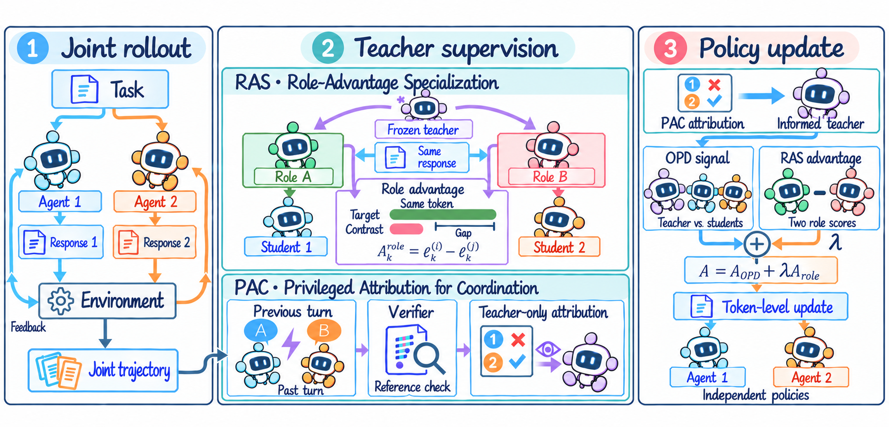

# MAS-OPD: On-Policy Distillation for Multi-Agent Systems

> **复现级别：L1 核心机制诊断。** 执行 role advantage 与 privileged conflict mask；未进行多模型 MAS 联训。

## 论文信息

| 字段 | 内容 |
|---|---|
| 论文链接 | [MAS-OPD: On-Policy Distillation for Multi-Agent Systems](https://arxiv.org/abs/2609.34234) |
| 公司/机构 | University of Science and Technology of China（按第一作者署名单位） |
| 首次公开日期 | 2026-09-28（arXiv v1） |
| 原文开源代码 | 否：截至 2026-09-30 未找到原作者公开仓库 |
| Adapter / 方法 | `mas-opd` |
| 本地复现代码 | [`src/auto_research/post_training/latest_20260930_closure.py`](https://github.com/daiwk/auto-research/blob/main/src/auto_research/post_training/latest_20260930_closure.py) |

## 原始论文总结

### 背景与主要改动

以目标角色与非目标角色 teacher 信号差构造 role advantage，并把协作冲突归因只提供给 teacher 形成 privileged coordination supervision。

<!-- paper-figure:start -->
### 原论文关键图

> **原论文 Figure 2（关键图）**：展示原论文方法的总体设计和关键组成。图片来自[原论文](https://arxiv.org/abs/2609.34234)，版权归原作者所有；点击图片可查看来源。
<!-- paper-figure:end -->

### 核心公式

本地 reference kernel 保留论文决定性的门控、掩码、递归、信用权重或晋级条件；测试同时检查梯度隔离、类型边界和确定性。

### 论文离线与线上效果

论文中的 benchmark、速度或训练曲线属于原文结果。本地三种子 mini-suite 仅检验机制和不变量，不与论文规模结果横比，也不外推线上收益。

## 本地复现

三种子诊断见 [`metrics/mechanism-seeds42-44.json`](metrics/mechanism-seeds42-44.json)。其中 `diagnostic_only=true`，不能进入正式能力排名。

## 复现边界

执行 role advantage 与 privileged conflict mask；未进行多模型 MAS 联训。
