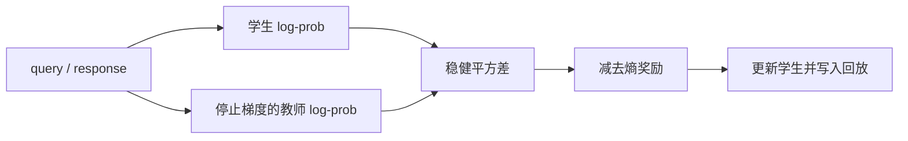
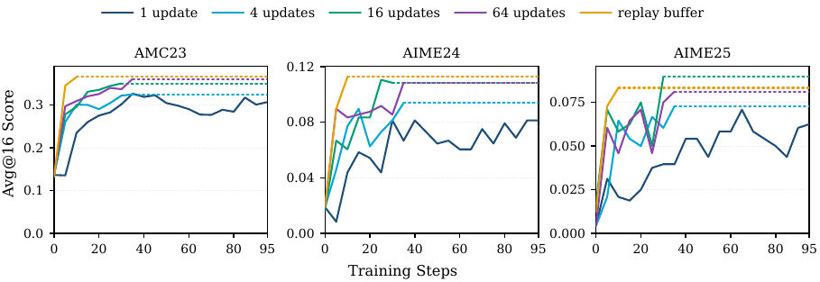

# LSPD：从强化学习视角重写 On-Policy Distillation

> **复现级别：L1 核心机制 + 真实 checkpoint CUDA 路径。** 实现稳健 least-square policy-distillation 目标与离策略回放容器；不外推完整推理训练收益。

## 论文信息

| 字段 | 内容 |
|---|---|
| 论文链接 | [An RL View of OPD: Least Square Policy Distillation for Sample-Efficient LLM Reasoning](https://arxiv.org/abs/2609.35505) |
| 公司 / 机构 | University of North Carolina at Chapel Hill（第一作者署名单位） |
| 首次公开日期 | 2026-09-28（arXiv v1） |
| 原作者代码 | 是：[UNCSciML/LSPD](https://github.com/UNCSciML/LSPD) |
| 本地 adapter / 方法 | `lspd` |
| 本地复现代码 | [`src/auto_research/post_training/latest_20260930.py`](https://github.com/daiwk/auto-research/blob/main/src/auto_research/post_training/latest_20260930.py) |

## 原始论文总结

### 背景与主要改动

LSPD 把教师与学生的 token log-prob 差视作可优化残差，以 least-square 形式直接收缩分布差距，并用 Huber 式尾部限制异常差值的梯度；同时允许复用历史 query-response 轨迹，提高样本效率。

<!-- paper-figure:start -->
### 原论文关键图

> **原论文方法图**：展示 OPD 的 RL 解释和 LSPD 数据复用流程。图片来自[原论文](https://arxiv.org/abs/2609.35505)，版权归原作者所有。
<!-- paper-figure:end -->

### 核心公式

对差值 \(d_t=\log\pi_\theta(y_t)-\operatorname{sg}(\log\pi_T(y_t))\)，本地实现 \(|d_t|\le c\) 时的 \(d_t^2\) 与尾部 \(2c|d_t|-c^2\)，再减去熵系数项。每个 response 先按有效 token 平均，再在 batch 内等权平均。

### 论文离线与线上效果

论文给出的推理 benchmark 与样本效率属于原文结果。本地三种子产物只证明教师停止梯度、稳健尾部、response mask 与回放边界正确，见 [`metrics/mechanism-seeds42-44.json`](metrics/mechanism-seeds42-44.json)。

## 本地复现

`lspd_objective` 和 `LSPDReplayBuffer` 可独立用于训练；通用后训练 CLI 的 `lspd` 为 L1 候选策略类比诊断。汇总实验见 [`../../experiments/sep30-p0-p1-mechanisms-seeds42-44.json`](../../experiments/sep30-p0-p1-mechanisms-seeds42-44.json)。

## 复现边界

未复现原作者完整 reasoning 数据管线与大规模教师 rollout，也未接入 Evolve。只有控制器能执行真实 LSPD 更新并在隔离验证集评价时，才会标为可进化算子。
