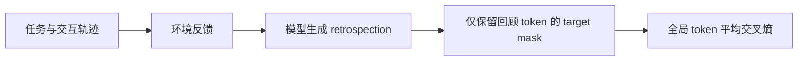
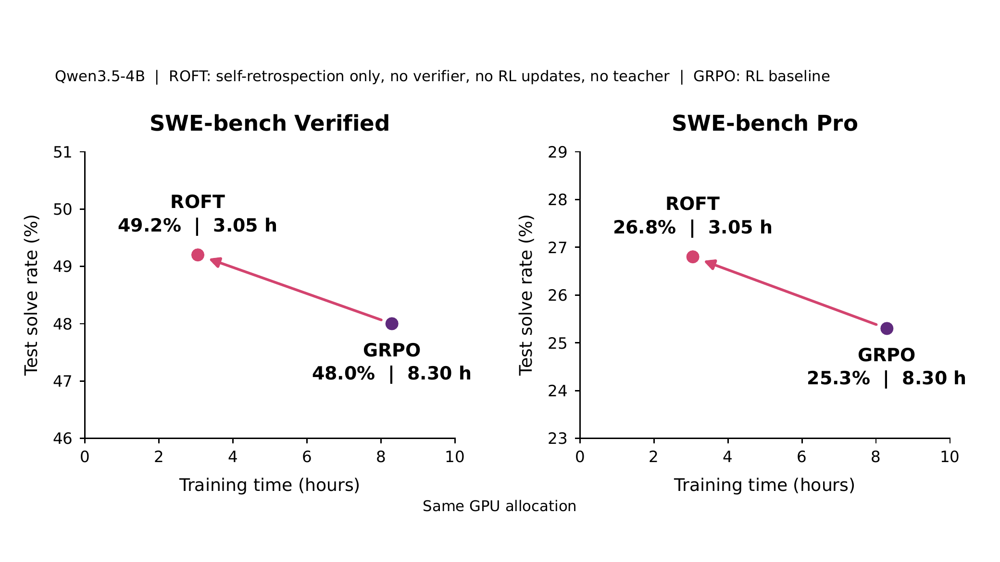

# ROFT：用自我回顾监督改进 Agent

> **复现级别：L1 核心机制 + 真实 checkpoint CUDA 路径。** 本地实现全局 retrospection-token 交叉熵；不声称复现论文规模训练收益。

## 论文信息

| 字段 | 内容 |
|---|---|
| 论文链接 | [Shockingly Simple Self-retrospection Improves Agentic Models Without RL](https://arxiv.org/abs/2609.35741) |
| 公司 / 机构 | Rensselaer Polytechnic Institute（第一作者署名单位） |
| 首次公开日期 | 2026-09-28（arXiv v1） |
| 原作者代码 | 截至 2026-09-30 未发现/未发布原作者代码 |
| 本地 adapter / 方法 | `roft` |
| 本地复现代码 | [`src/auto_research/post_training/latest_20260930.py`](https://github.com/daiwk/auto-research/blob/main/src/auto_research/post_training/latest_20260930.py) |

## 原始论文总结

### 背景与主要改动

ROFT 不直接用环境奖励更新动作策略，而是让模型在完整轨迹与反馈之后生成一段自我回顾，再只监督回顾 token。回顾成为后续行为可复用的训练信号，同时避免把环境文本或历史动作误当监督标签。

<!-- paper-figure:start -->
### 原论文关键图

> **原论文方法总览图**：展示轨迹、反馈、自我回顾与下一轮行为之间的关系。图片来自[原论文](https://arxiv.org/abs/2609.35741)，版权归原作者所有。
<!-- paper-figure:end -->

### 核心公式

设回顾 token 集合为 \(R\)，本地严格执行论文的全局归一化目标：\(\mathcal L=-\frac{1}{|R|}\sum_{t\in R}\log p_\theta(r_t\mid x,\tau,f,r_{<t})\)。任务、动作、观察与反馈位置的 target mask 均为 0，但仍可作为回顾生成的上下文。

### 论文离线与线上效果

原文在多种 Agent 任务上报告自我回顾监督的收益；本地不复写为自己的结果。这里只验证 mask、梯度和真实 checkpoint CUDA 前后向，三种子诊断见 [`metrics/mechanism-seeds42-44.json`](metrics/mechanism-seeds42-44.json)。

## 本地复现

`roft_retrospection_loss` 是可训练的 PyTorch 目标；通用后训练 CLI 中的 `roft` 只提供小型候选策略诊断。汇总实验见 [`../../experiments/sep30-p0-p1-mechanisms-seeds42-44.json`](../../experiments/sep30-p0-p1-mechanisms-seeds42-44.json)。

## 复现边界

当前没有论文规模 Agent rollout 数据，也没有把 ROFT 注册进 Evolve；在统一控制器能够实际构造回顾数据、训练并用隔离验证集评价前，不把 registry 标签当成已接入。
