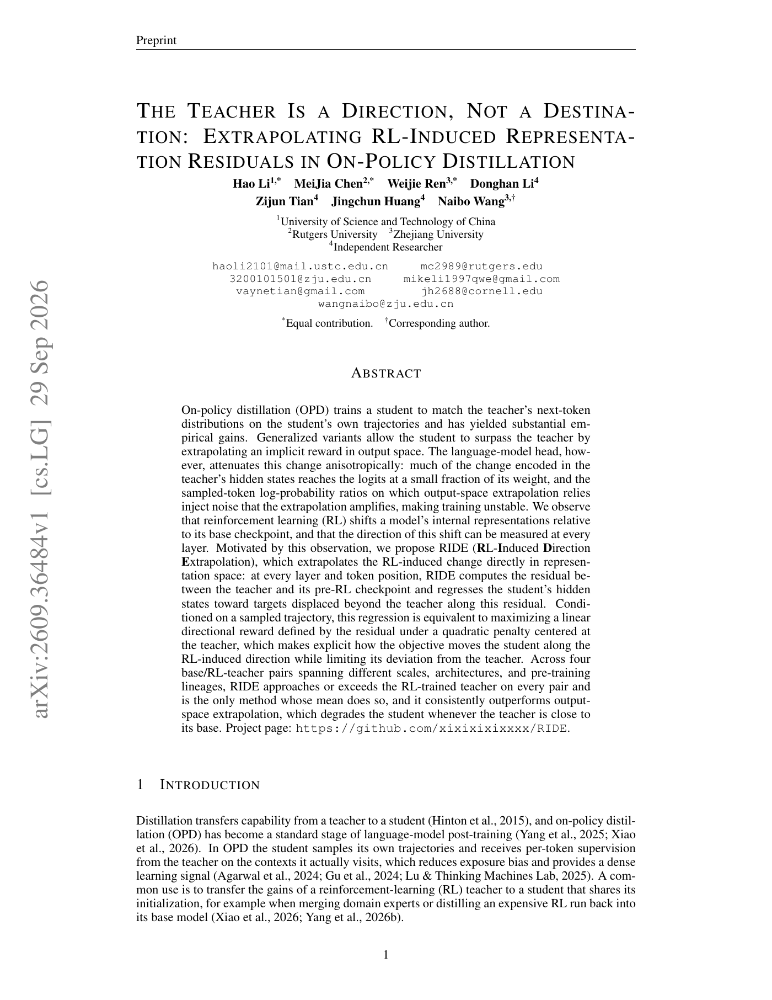

# RIDE：沿 RL 表征残差外推

> **复现级别：L1 表征目标。** 实现 base→RL teacher 的逐层残差外推与 masked regression。

## 论文信息

| 字段 | 内容 |
|---|---|
| 论文链接 | [arXiv v1](https://arxiv.org/abs/2609.36484) |
| 公司/机构 | 原文未列机构 |
| 首次公开日期 | 2026-09-29（arXiv v1） |
| 原文开源代码 | 是：[xixixixixxxx/RIDE](https://github.com/xixixixixxxx/RIDE) |
| Adapter | `ride-opd` |
| 本地复现代码 | `src/auto_research/post_training/latest_20260930_followup.py` |

### 背景与主要改动

RIDE 不在输出概率空间放大 teacher/student ratio，而是在每层每个 token 计算 RL teacher 相对其 pre-RL checkpoint 的 hidden residual：$r=h_T-h_B$；学生回归到 $h_B+\alpha r$，其中 $\alpha>1$ 把方向延伸到 teacher 之外。teacher/base 均 stop-gradient，避免目标分支被学生更新。

<!-- paper-figure:start -->
### 原论文关键图

> 原论文首页的 RIDE 概览，展示 output-space 与 representation-space 外推差异。图片来自[原论文](https://arxiv.org/abs/2609.36484)，版权归原作者所有。
<!-- paper-figure:end -->

## 本地复现

`ride_target` 与 `ride_loss` 覆盖 $α=1$ 退化、$α>1$ 外推、mask 和 teacher stop-gradient；三种子机制结果见 [`metrics/mechanism-seeds42-44.json`](metrics/mechanism-seeds42-44.json)。未加载四组真实 base/RL teacher checkpoint，不能视为论文效果复现。
