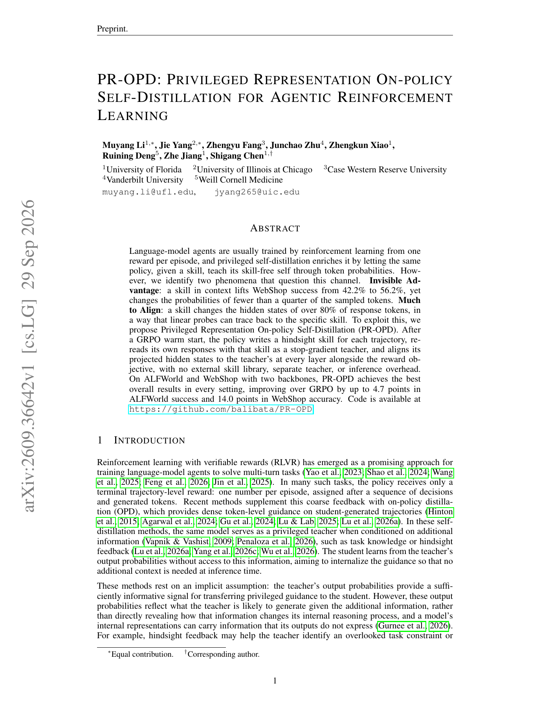

# PR-OPD：Agentic RL 的特权表征自蒸馏

> **复现级别：L1 表征对齐目标。** 实现多层、多 response-token 的 stop-gradient privileged alignment。

## 论文信息

| 字段 | 内容 |
|---|---|
| 论文链接 | [arXiv v1](https://arxiv.org/abs/2609.36642) |
| 公司/机构 | University of Florida（第一作者） |
| 首次公开日期 | 2026-09-29（arXiv v1） |
| 原文开源代码 | 是：[balibata/PR-OPD](https://github.com/balibata/PR-OPD) |
| Adapter | `pr-opd` |
| 本地复现代码 | `src/auto_research/post_training/latest_20260930_followup.py` |

### 背景与主要改动

GRPO warm start 后，策略为每条已完成轨迹写一条 hindsight skill，并对同一 response 做普通 context 与 skill context 两次 forward。后者是 stop-gradient teacher；PR-OPD 在每层、每个 response token 对齐投影 hidden state，再与 reward objective 组合。推理时 skill 和 teacher 分支都移除。

<!-- paper-figure:start -->
### 原论文关键图

> 原论文 Figure 1，展示概率信号稀疏而 hidden-state 变化广泛的动机。图片来自[原论文](https://arxiv.org/abs/2609.36642)，版权归原作者所有。
<!-- paper-figure:end -->

## 本地复现

测试覆盖相同表征时零损失、不同表征时正损失、mask 与 teacher stop-gradient；三种子机制结果见 [`metrics/mechanism-seeds42-44.json`](metrics/mechanism-seeds42-44.json)。未运行 ALFWorld/WebShop 或 GRPO warm start，不能宣称论文最高 `+14.0` 点结果。
