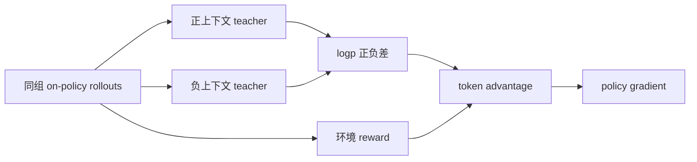
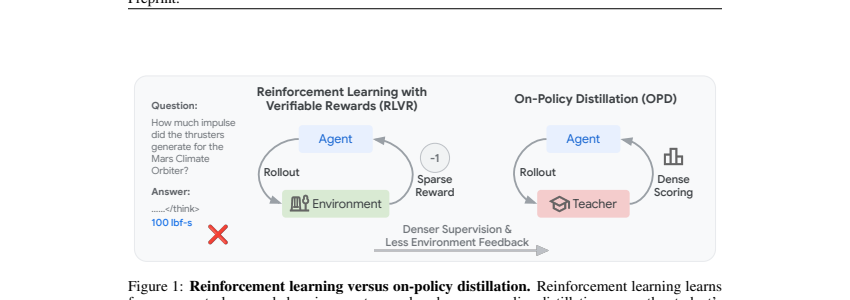

# SIPO：RLVR 与 on-policy self-distillation 的统一

> **复现级别：L1 目标函数。** 实现双上下文 contrastive self-teacher、逐 token advantage 和 policy-gradient 组合；未执行论文规模 rollout 训练。

## 论文信息

| 字段 | 内容 |
|---|---|
| 论文链接 | [SIPO](https://arxiv.org/abs/2609.36742) |
| 公司 / 机构 | University of Illinois Urbana-Champaign（第一作者署名单位） |
| 首次公开日期 | 2026-09-29（arXiv v1） |
| 原作者代码 | 是：[Yueeeeeeee/SIPO](https://github.com/Yueeeeeeee/SIPO) |
| 本地 adapter / 方法 | `sipo` |
| 本地复现代码 | [`src/auto_research/post_training/latest_20260930.py`](https://github.com/daiwk/auto-research/blob/main/src/auto_research/post_training/latest_20260930.py) |

## 原始论文总结

### 背景与主要改动

RLVR 的轨迹 reward 稀疏，普通 OPSD 又会受自教师过度自信和长序列惩罚影响。SIPO 对同一 rollout 构造正/负两份特权上下文：两者 teacher log-prob 的差值抵消共享偏差，形成逐 token 信用；环境 reward 决定主方向，dense evidence 负责在 token 间重新分配。

<!-- paper-figure:start -->
### 原论文关键图

> 原论文 Figure 1，说明稀疏 RLVR 与 dense OPD 信号差异；版权归原作者所有。
<!-- paper-figure:end -->

### 核心公式

本地实现 $e_t=\log q_t^+-\log q_t^-$，并将中心化后的 $e_t$ 与组相对 outcome advantage 组合为 $A_t=A_{outcome}+\beta(e_t-\bar e)$；即使整组 reward 相同，contrastive teacher 仍能提供非零、但不泄漏 gold 到 student rollout 的 token 信号。

### 论文效果

论文在推理与代码任务上报告优于 RLVR 和 OPSD；本站不复制为本地效果。本地三种子指标见 [`metrics/mechanism-seeds42-44.json`](metrics/mechanism-seeds42-44.json)。

## 本地复现与边界

机制测试覆盖全失败组仍有 token 信号、有限梯度及 reward 主方向。A100 脱敏记录见 [`../../gpu-validations/sipo-a100-20260930.json`](../../gpu-validations/sipo-a100-20260930.json)。
