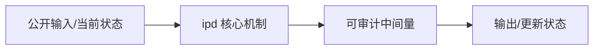
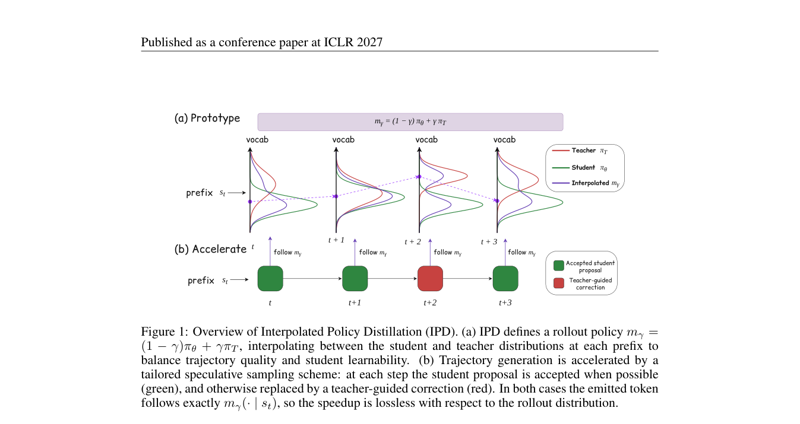

# Interpolated Policy Distillation: A Controllable Continuum Between Off-Policy and On-Policy Distillation

> **复现级别：L1 核心机制诊断。** 执行精确 token mixture；高吞吐 speculative sampler 和模型训练未复现。

## 论文信息

| 字段 | 内容 |
|---|---|
| 论文链接 | [arXiv 2609.37170](https://arxiv.org/abs/2609.37170) |
| 公司/机构 | WeChat Vision, Tencent（按第一作者署名单位） |
| 首次公开日期 | 2026-09-29（arXiv v1） |
| 原文开源代码 | 否：截至 2026-10-01 未找到原作者公开仓库 |
| Adapter | `ipd` |
| 本地复现代码 | [`src/auto_research/post_training/latest_20261001.py`](https://github.com/daiwk/auto-research/blob/main/src/auto_research/post_training/latest_20261001.py) |

## 原始论文总结

### 背景与主要改动

在每个 token 状态把 student 与 teacher 分布按 $m_\gamma=(1-\gamma)\pi_S+\gamma\pi_T$ 插值，从纯 on-policy 连续过渡到 off-policy teacher；论文再用验证感知的 speculative sampler 精确采样该目标策略。

<!-- paper-figure:start -->
### 原论文关键图

> **原论文 Figure 1（关键图）**：展示原论文方法的总体设计和关键组成。图片来自[原论文](https://arxiv.org/abs/2609.37170)，版权归原作者所有；点击图片可查看来源。
<!-- paper-figure:end -->

### 核心公式

$m_\gamma(\cdot|s)=(1-\gamma)\pi_S(\cdot|s)+\gamma\pi_T(\cdot|s)$；本地验证端点、归一化和总变差线性插值。

### 论文离线与线上效果

原文在文本与多模态任务上比较 SFT、OPD、SFT→OPD 与不同插值系数；本地不复述论文规模提升为自己的结果。

## 本地复现

> **本地对照口径**：基线为论文机制关闭或默认状态，实验组为开启对应核心算子；本批只验证不变量和状态转换，跨模型相对变化不适用。

三种子诊断见 [`metrics/mechanism-seeds42-44.json`](metrics/mechanism-seeds42-44.json)。`diagnostic_only=true`，只证明核心状态转换、梯度或调度不变量可执行，不能进入正式能力排名。

## 复现边界

执行精确 token mixture；高吞吐 speculative sampler 和模型训练未复现。
