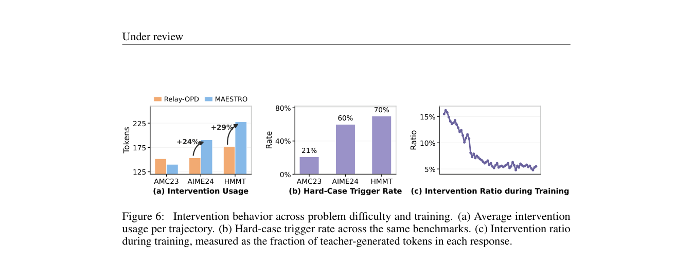

# From Dissonance to Orchestration: Teacher Intervention in On-Policy Distillation

> **复现级别：L1 核心机制诊断。** 执行 top-k coverage/Bhattacharyya PDS；未生成 teacher rollouts。

## 论文信息

| 字段 | 内容 |
|---|---|
| 论文链接 | [arXiv 2609.37510](https://arxiv.org/abs/2609.37510) |
| 公司/机构 | Nanyang Technological University（按第一作者署名单位） |
| 首次公开日期 | 2026-09-29（arXiv v1） |
| 原文开源代码 | 是：[https://github.com/yhao-wang/MAESTRO](https://github.com/yhao-wang/MAESTRO) |
| Adapter | `maestro-opd` |
| 本地复现代码 | [`src/auto_research/post_training/latest_20261001.py`](https://github.com/daiwk/auto-research/blob/main/src/auto_research/post_training/latest_20261001.py) |

## 原始论文总结

### 背景与主要改动

MAESTRO 用教师 top-k 覆盖度和 Bhattacharyya 相似度构造逐 token Policy Disagreement Score，并对靠近响应起点的位置加权；教师只在高分歧位置介入，减少整段 teacher rollout 的固定开销。

<!-- paper-figure:start -->
### 原论文关键图

> **原论文 Figure 6（关键图）**：展示原论文的训练流程与关键优化环节。图片来自[原论文](https://arxiv.org/abs/2609.37510)，版权归原作者所有；点击图片可查看来源。
<!-- paper-figure:end -->

### 核心公式

$PDS_t=1-C_tB_t$，其中 $C_t$ 是教师 top-k 在学生 top-k 中的概率覆盖，$B_t$ 是归一化 top-k 分布的 Bhattacharyya 系数。

### 论文离线与线上效果

Qwen3 0.6B/1.7B 在八个数学 benchmark 的 macro average 最佳，并相对标准 OPD 缩短约 67.3% 响应长度。

## 本地复现

> **本地对照口径**：基线为论文机制关闭或默认状态，实验组为开启对应核心算子；本批只验证不变量和状态转换，跨模型相对变化不适用。

三种子诊断见 [`metrics/mechanism-seeds42-44.json`](metrics/mechanism-seeds42-44.json)。`diagnostic_only=true`，只证明核心状态转换、梯度或调度不变量可执行，不能进入正式能力排名。

## 复现边界

执行 top-k coverage/Bhattacharyya PDS；未生成 teacher rollouts。
