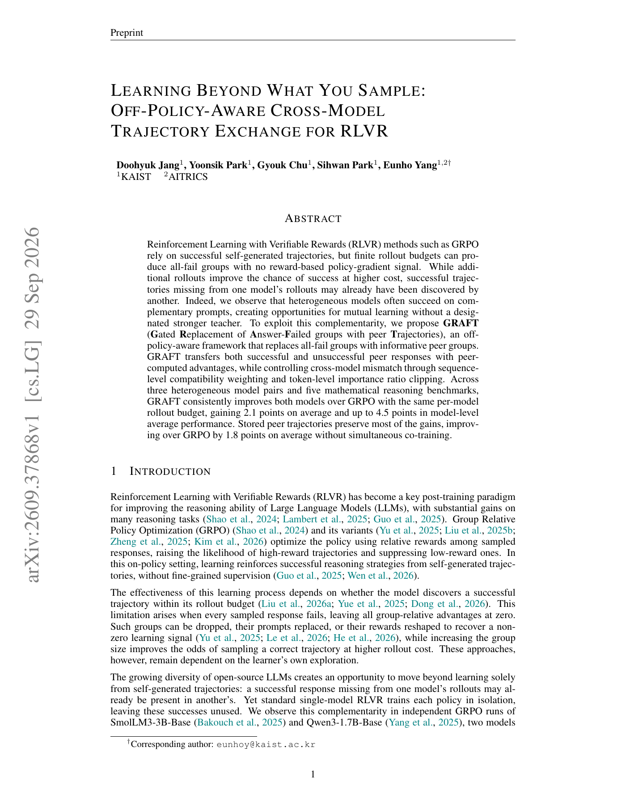

# GRAFT：跨模型交换 all-fail 轨迹组

> **复现级别：L1 目标机制。** 实现 peer compatibility gate、source advantage 保留与 token ratio clipping。

## 论文信息

| 字段 | 内容 |
|---|---|
| 论文链接 | [arXiv v1](https://arxiv.org/abs/2609.37868) |
| 公司/机构 | KAIST（第一作者） |
| 首次公开日期 | 2026-09-29（arXiv v1） |
| 原文开源代码 | 否：截至 2026-09-30 未找到原作者仓库 |
| Adapter | `graft` |
| 本地复现代码 | `src/auto_research/post_training/latest_20260930_followup.py` |

### 背景与主要改动

当 receiver 的 rollout group 全错、peer 在同题同时有成功和失败轨迹时，GRAFT 用完整 peer group 替换无信号组并保留 peer 内部 advantage。跨 tokenizer 的策略错配通过序列平均 log-likelihood compatibility 加权，再用 token importance ratio clipping 限制更新。

<!-- paper-figure:start -->
### 原论文关键图

> 原论文 Figure 1，展示异构模型在 all-fail prompt 上的互补成功。图片来自[原论文](https://arxiv.org/abs/2609.37868)，版权归原作者所有。
<!-- paper-figure:end -->

## 本地复现

本地目标检查低兼容 peer 被降权、ratio 越界被截断且 advantage 不回传；三种子机制结果见 [`metrics/mechanism-seeds42-44.json`](metrics/mechanism-seeds42-44.json)。未进行双模型 GRPO 联训或五个数学 benchmark，故不宣称论文平均 `+2.1` 分收益。
