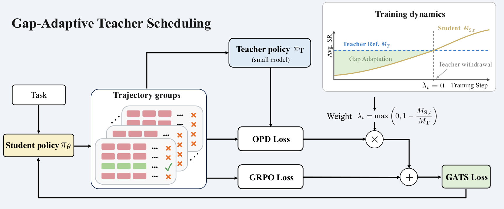

# Guide, Then Let Go: Gap-Adaptive Teacher Scheduling for Sparse-Reward Agentic RL

> **复现级别：L1 核心机制诊断。** 执行滞后一拍移动平均、gap weight 和永久 withdrawal；未做 Qwen Agent RL。

## 论文信息

| 字段 | 内容 |
|---|---|
| 论文链接 | [arXiv 2609.37898](https://arxiv.org/abs/2609.37898) |
| 公司/机构 | Dalian University of Technology / Kuaishou（按第一作者署名单位） |
| 首次公开日期 | 2026-09-29（arXiv v1） |
| 原文开源代码 | 是：[https://github.com/Ricardo-H/guide-then-let-go](https://github.com/Ricardo-H/guide-then-let-go) |
| Adapter | `gats` |
| 本地复现代码 | [`src/auto_research/post_training/latest_20261001.py`](https://github.com/daiwk/auto-research/blob/main/src/auto_research/post_training/latest_20261001.py) |

## 原始论文总结

### 背景与主要改动

用教师训练尾部成功率作为固定参考，以学生滞后一拍的移动平均估计能力差距；OPD 权重随差距线性下降，学生达到教师参考后永久关闭教师分支，继续只做 GRPO。

<!-- paper-figure:start -->
### 原论文关键图

> **原论文 Figure 2（关键图）**：展示原论文的训练流程与关键优化环节。图片来自[原论文](https://arxiv.org/abs/2609.37898)，版权归原作者所有；点击图片可查看来源。
<!-- paper-figure:end -->

### 核心公式

$\lambda_t=\max(1-M_{S,t}/M_T,0)$，$L_{GATS}=L_{GRPO}+(1-d_t)\lambda_tL_{OPD}$；$M_{S,t}\ge M_T$ 后 $d_t$ 永久置一。

### 论文离线与线上效果

三组 Qwen2.5 teacher/student 配置均优于 matched-budget GRPO，平均成功率提高 4.37–11.87 个百分点。

## 本地复现

> **本地对照口径**：基线为论文机制关闭或默认状态，实验组为开启对应核心算子；本批只验证不变量和状态转换，跨模型相对变化不适用。

三种子诊断见 [`metrics/mechanism-seeds42-44.json`](metrics/mechanism-seeds42-44.json)。`diagnostic_only=true`，只证明核心状态转换、梯度或调度不变量可执行，不能进入正式能力排名。

## 复现边界

执行滞后一拍移动平均、gap weight 和永久 withdrawal；未做 Qwen Agent RL。
