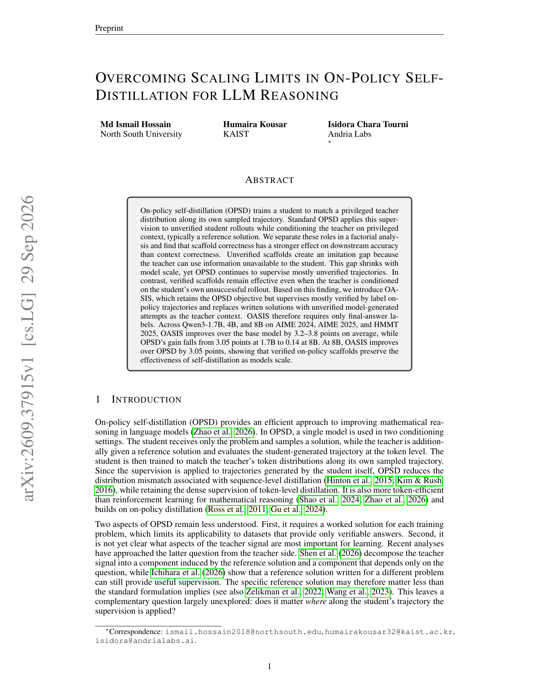

# OASIS：在可验证 scaffold 上做 OPSD

> **复现级别：L1 选择与损失机制。** 实现 shortest verified scaffold、独立同题 context 和 clipped forward-KL。

## 论文信息

| 字段 | 内容 |
|---|---|
| 论文链接 | [arXiv v1](https://arxiv.org/abs/2609.37915) |
| 公司/机构 | North South University（第一作者） |
| 首次公开日期 | 2026-09-29（arXiv v1） |
| 原文开源代码 | 否：截至 2026-09-30 未找到原作者仓库 |
| Adapter | `oasis-opsd` |
| 本地复现代码 | `src/auto_research/post_training/latest_20260930_followup.py` |

### 背景与主要改动

OASIS 把“在哪里监督”和“teacher 看什么 context”解耦：从同一题的 on-policy rollouts 中选最短的已验证轨迹作为 scaffold；teacher context 优先使用另一条未验证尝试；没有 verified rollout 的题不产生训练信号。这样只需要最终答案 verifier，而不需要 gold solution。

<!-- paper-figure:start -->
### 原论文关键图

> 原论文 Figure 1，展示 teacher 优势集中在失败轨迹及 OASIS 随规模保持收益。图片来自[原论文](https://arxiv.org/abs/2609.37915)，版权归原作者所有。
<!-- paper-figure:end -->

## 本地复现

测试保证未验证短轨迹不会被误选、teacher context 与 scaffold 不同、mask 外 token 无梯度。三种子机制结果见 [`metrics/mechanism-seeds42-44.json`](metrics/mechanism-seeds42-44.json)。未运行 Qwen3 1.7B–8B rollout/training，属于机制实现，不宣称 AIME/HMMT 增益。
