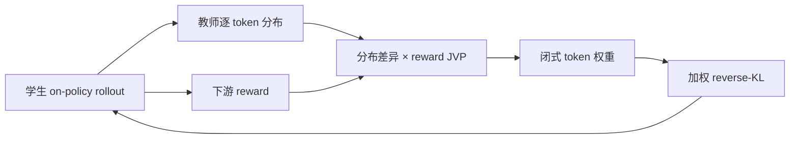
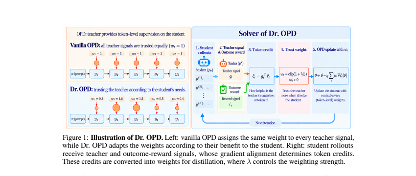

# Dr. OPD：按下游收益加权的 on-policy distillation

> **复现级别：L1 目标函数。** 实现 discrepancy × reward-JVP token credit、闭式权重更新和加权 reverse-KL；未进行论文规模的双层迭代训练。

## 论文信息

| 字段 | 内容 |
|---|---|
| 论文链接 | [Dr. OPD](https://arxiv.org/abs/2609.38025) |
| 公司 / 机构 | Rutgers University（第一作者署名单位） |
| 首次公开日期 | 2026-09-29（arXiv v1） |
| 原作者代码 | 是：[zywang0701/Dr-OPD](https://github.com/zywang0701/Dr-OPD) |
| 本地 adapter / 方法 | `dr-opd` |
| 本地复现代码 | [`src/auto_research/post_training/latest_20260930.py`](https://github.com/daiwk/auto-research/blob/main/src/auto_research/post_training/latest_20260930.py) |

## 原始论文总结

### 背景与主要改动

普通 OPD 对每个 teacher token 信号等权，但改正关键推理错误与替换同义措辞的下游价值不同。Dr. OPD 用双层优化定义“更新学生后预期 reward 最大”的 token 权重，并在每轮先闭式更新权重，再执行一次加权 OPD。

<!-- paper-figure:start -->
### 原论文关键图

> 原论文 Figure 1：从 student rollout、teacher 信号到闭式 token weight 的求解器；版权归原作者所有。
<!-- paper-figure:end -->

### 核心公式

本地以 $c_t=d_t\,g_t$ 表示 teacher-student discrepancy 与 reward 对该 token 更新方向的 JVP 乘积，再计算 $w_t=\mathrm{clip}(1+c_t/\lambda,0,w_{max})$ 并做均值归一化；训练损失为 $\sum_t w_t D_{KL}(p_{student,t}\Vert p_{teacher,t})$。

### 论文效果

论文在数学与代码的强到弱/同规模蒸馏中报告稳定优于 vanilla OPD，强到弱数学平均提升 9.7 分。本站仅报告机制诊断 [`metrics/mechanism-seeds42-44.json`](metrics/mechanism-seeds42-44.json)，不把论文值写成本地收益。

## 本地复现与边界

本地验证权重有界、梯度有限和不同 token credit 能产生差异化权重。A100 脱敏记录见 [`../../gpu-validations/dr-opd-a100-20260930.json`](../../gpu-validations/dr-opd-a100-20260930.json)。
