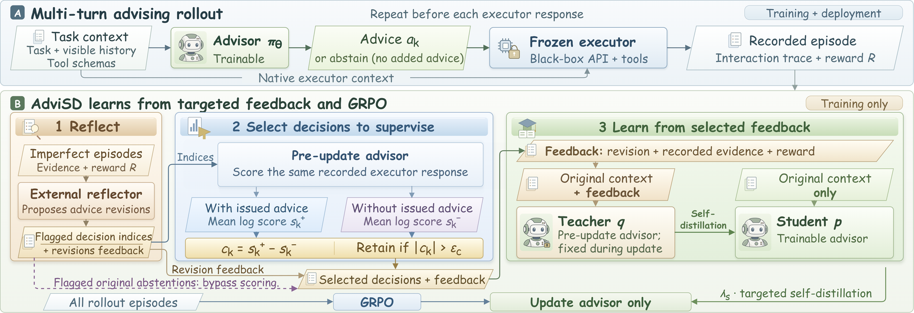

# AdviSD: Learning to Advise Frontier LLMs via Targeted Multi-Turn Self-Distillation

> **复现级别：L1 核心机制诊断。** 执行 paired contrast、donor calibration 和选择 gate；不调用 Gemini/Claude executor，未复现 BFCL-v3。

## 论文信息

| 字段 | 内容 |
|---|---|
| 论文链接 | [arXiv 2609.38142](https://arxiv.org/abs/2609.38142) |
| 公司/机构 | University of Southern California（按第一作者署名单位） |
| 首次公开日期 | 2026-09-29（arXiv v1） |
| 原文开源代码 | 否：截至 2026-10-01 未找到原作者公开仓库 |
| Adapter | `advisd` |
| 本地复现代码 | [`src/auto_research/post_training/latest_20261001.py`](https://github.com/daiwk/auto-research/blob/main/src/auto_research/post_training/latest_20261001.py) |

## 原始论文总结

### 背景与主要改动

冻结 executor，只训练 advisor；反思先提出修正，再对同一已记录 executor 响应分别计算有建议与无建议的平均 log-likelihood，只有影响幅度超过 donor-advice 校准阈值的决定才进入自蒸馏。

<!-- paper-figure:start -->
### 原论文关键图

> **原论文 Figure 1（关键图）**：展示原论文的训练流程与关键优化环节。图片来自[原论文](https://arxiv.org/abs/2609.38142)，版权归原作者所有；点击图片可查看来源。
<!-- paper-figure:end -->

### 核心公式

$c_k=T_k^{-1}\sum_t[\log\pi(y_{k,t}|C_k^+)-\log\pi(y_{k,t}|C_k^-)]$；阈值是 donor contrast 绝对值的经验分位数。

### 论文离线与线上效果

相对 advisor-GRPO，BFCL-v3 提高 4.2–6.4 个百分点，EnvScaler 提高 3.9–5.1 分。

## 本地复现

> **本地对照口径**：基线为论文机制关闭或默认状态，实验组为开启对应核心算子；本批只验证不变量和状态转换，跨模型相对变化不适用。

三种子诊断见 [`metrics/mechanism-seeds42-44.json`](metrics/mechanism-seeds42-44.json)。`diagnostic_only=true`，只证明核心状态转换、梯度或调度不变量可执行，不能进入正式能力排名。

## 复现边界

执行 paired contrast、donor calibration 和选择 gate；不调用 Gemini/Claude executor，未复现 BFCL-v3。
