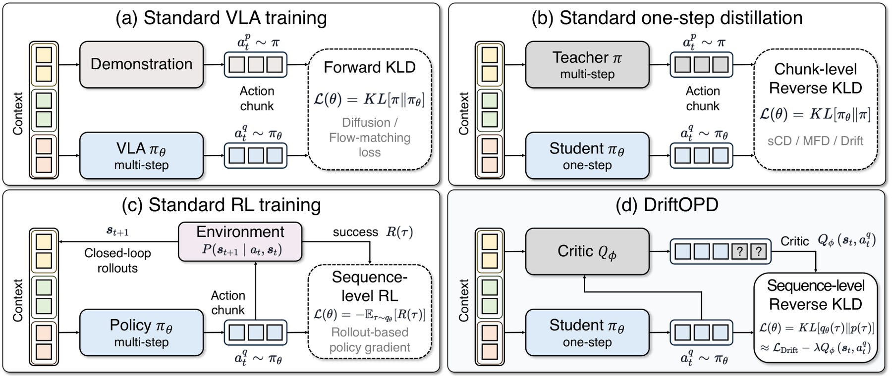

# DriftOPD: Sequence-Level Reverse-KL Distillation for One-Step VLA Policies

> **复现级别：L1 核心机制诊断。** 执行 objective 分解和 teacher stop-gradient；未运行机器人环境。

## 论文信息

| 字段 | 内容 |
|---|---|
| 论文链接 | [arXiv v1](https://arxiv.org/abs/2610.00317) |
| 公司/机构 | KAIST（按第一作者署名单位） |
| 首次公开日期 | 2026-09-29（arXiv v1） |
| 原文开源代码 | 否：截至 2026-10-03 未找到原作者公开实现 |
| Adapter | `drift-opd` |
| 本地复现代码 | [`src/auto_research/post_training/latest_20261003.py`](https://github.com/daiwk/auto-research/tree/main/src/auto_research/post_training/latest_20261003.py) |

## 原始论文总结

### 背景与主要改动

把序列级 reverse-KL 拆成当前 chunk 的一步 reverse-KL 与刻画长期动作后果的 future potential；critic 从离线 demonstrations 学习。

<!-- paper-figure:start -->
### 原论文关键图

> **原论文 Figure 2（关键图）**：展示原论文的训练流程与关键优化环节。图片来自[原论文](https://arxiv.org/abs/2610.00317)，版权归原作者所有；点击图片可查看来源。
<!-- paper-figure:end -->

### 核心公式

$L=KL(\pi_S\|\pi_T)-\lambda E[V_{future}]$。

### 论文离线与线上效果

论文在连续 VLA 策略上报告无需在线 rollout 的长程任务改进。

## 本地复现

> **本地对照口径**：基线为机制关闭或默认状态，实验组执行定义性算子；L1 不报告正式相对提升，百分比不适用。

- 三种子诊断：[`metrics/mechanism-seeds42-44.json`](metrics/mechanism-seeds42-44.json)
- `diagnostic_only=true`，不进入正式能力排名。

## 复现边界

执行 objective 分解和 teacher stop-gradient；未运行机器人环境。
