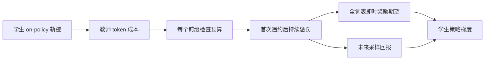
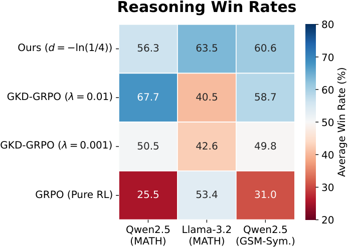

# The Weakest Link：前缀最坏约束蒸馏

> **L1 可微目标与优化诊断**。真实执行全词表即时奖励梯度和未来 Monte Carlo 回报，不等于已蒸馏完整推理模型。

## 论文信息

| 字段 | 内容 |
|---|---|
| 论文链接 | [arXiv 2610.00332](https://arxiv.org/abs/2610.00332) |
| 公司/机构 | Huawei Noah’s Ark Lab（一作 Matthieu Zimmer） |
| 首次公开日期 | 2026-09-29（arXiv v1，以官方首次提交日期而非 ID 月份为准） |
| 原文开源代码 | 未找到作者公开代码（2026-10-04 全文核查） |
| Adapter | `weakest-link`（Python 机制 API） |
| 本地复现代码 | [`src/auto_research/post_training/oct04_objectives.py`](https://github.com/daiwk/auto-research/blob/main/src/auto_research/post_training/oct04_objectives.py) |

## 原始论文总结

### 背景与主要改动

把教师对学生采样 token 的负对数概率当作成本，约束每个生成前缀的平均成本。一旦某个前缀越界，后续进入吸收惩罚状态，防止“先生成坏推理、再靠容易 token 拉低平均成本”；同时把即时奖励的全词表期望精确求导，降低只采样当前动作的方差。

<!-- paper-figure:start -->
### 原论文关键图

> **原论文 Figure 4（关键图）**：展示原论文方法的总体设计和关键组成。图片来自[原论文](https://arxiv.org/abs/2610.00332)，版权归原作者所有；点击图片可查看来源。
<!-- paper-figure:end -->

### 核心公式

$c_t=-\log\pi_T(a_t\mid s_t)$，约束所有 $t$ 满足 $\frac{1}{t}\sum_{i\le t}c_i\le d$。违约标记采用 cumulative maximum，不允许恢复。

$$
L=-\sum_t\gamma^t\left[\sum_a\pi_\theta(a\mid s_t)\hat R(s_t,a)+\gamma G_{t+1}\log\pi_\theta(a_t\mid s_t)\right].
$$

反事实即时成本使用真实访问前缀的已发生历史成本，再枚举当前动作；不能为每个动作换一个虚构历史。教师分数和奖励 detach，只更新学生。

### 论文离线与线上效果

论文研究受约束推理蒸馏，在教师引导与任务奖励间控制最坏前缀偏离。Figure 4 的推理质量配对胜率，在 Qwen2.5/MATH、Llama-3.2/MATH、Qwen2.5/GSM-Sym. 三种设置下分别为 56.3%、63.5%、60.6%；这是 reasoning win rate，不是答题准确率，也不是本地结果。教师只参与训练约束，推理不需要调用教师。未报告生产线上 A/B。

## 本地复现

`PYTHONPATH=src python scripts/run_oct04_seven_papers.py` 对三动作学生策略训练 80 步 Adam，三个随机初始 seed；教师分布固定公开为 `[0.7,0.29,0.01]`，预算 2，惩罚 4。

[产物](metrics/mechanism-seeds42-44.json)中高成本动作的平均概率从 0.3546 降至 0.01036。这里只验证约束是否驱动正确梯度，没有能力提升或泛化结论。额外测试检查单步梯度等于枚举期望、后续惩罚传回此前采样动作，以及越界前缀不被后续低成本抵消。

## 复现边界

API 输入一条无 padding 的 on-policy 轨迹，以及每个访问前缀的全词表教师 log-prob 和任务奖励。调用方负责真实教师/学生 rollout、变长批处理、基准和同预算对照；本次未接入完整 LLM 训练。
