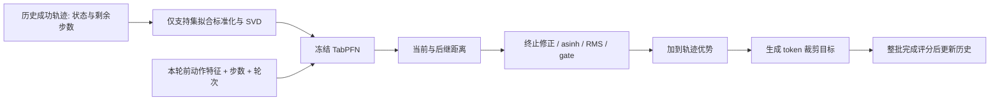
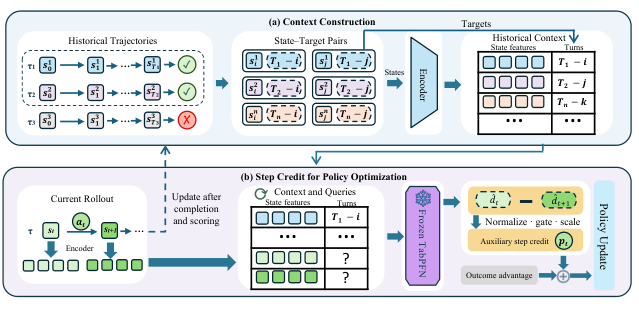

# T2SPO：从轨迹奖励到步骤信用

> **L1 核心机制诊断**：实现真实冻结 TabPFN 距离预测、历史支持集、步骤信用和 token 裁剪目标。没有用启发式回归器冒充 TabPFN；尚未复现完整 LLM＋ALFWorld 训练。

## 论文信息

| 字段 | 内容 |
|---|---|
| 论文链接 | [arXiv 2610.00388](https://arxiv.org/abs/2610.00388) |
| 公司/机构 | Nanjing University（一作 Bo-Wen Zhang；论文另列 ByteDance 实习合作） |
| 首次公开日期 | 2026-09-30（arXiv v1） |
| 原文开源代码 | 未找到作者公开实现（2026-10-04 全文核查）；TabPFN 是独立的上游依赖，不等于 T2SPO 官方代码 |
| Adapter | `t2spo`（Python 机制 API） |
| 本地复现代码 | [`agent_research/t2spo.py`](https://github.com/daiwk/auto-research/blob/main/src/auto_research/agent_research/t2spo.py)、[`post_training/oct04_objectives.py`](https://github.com/daiwk/auto-research/blob/main/src/auto_research/post_training/oct04_objectives.py) |

## 原始论文总结

### 背景与主要改动

用历史成功轨迹中的剩余步数训练上下文内距离估计器，预测每个状态距离成功还多远；把相邻状态的距离改善转为步骤优势，与轨迹级奖励共同优化。冻结 TabPFN 避免额外训练 critic，失败轨迹不被误标成接近成功的正样本。



<!-- paper-figure:start -->
### 原论文关键图

[](https://arxiv.org/html/2610.00388v1/t2spo_overview.png)

> **原论文 Figure 1（关键图）**：展示原论文方法的总体设计和关键组成。图片来自[原论文](https://arxiv.org/abs/2610.00388)，版权归原作者所有；点击图片可查看来源。
<!-- paper-figure:end -->

### 核心公式

成功轨迹状态标签为 $y_t=T-t$（实现零基索引，最后一个前动作状态为 1）。
$F_t=d_t-\gamma d_{t+1}$；成功终止的 $d_{t+1}=0$，失败终止的 $F_t=0$。
GRPO 对截断步骤信用置零；PPO 使用真实后继预测，不把截断当成功。

$$
c_t=w g_t\operatorname{clip}\left(\frac{\operatorname{asinh}(F_t)}{\sqrt{\operatorname{mean}_{m_t=1}\operatorname{asinh}(F_t)^2}+\epsilon},-C,C\right).
$$

调用方提供已结合有效预测、支持充分度和观察变化的 mask。主线 GRPO 再计算 $A_t=A^{outcome}_t+c_t$，使用 token masked clipped surrogate；观察和 padding token 不反传。PPO 扩展应把信用先加到奖励再重算 GAE，并用整回合似然比；本次 `optimizer="ppo"` **只切换信用的截断语义**，没有实现 PPO critic/GAE 训练器，不能把 token 目标冒充完整 PPO。

### 论文离线与线上效果

论文比较 ALFWorld/WebShop 等多轮任务中的步骤信用与轨迹奖励训练，区分 GRPO/PPO 和稀疏反馈条件。未报告生产线上 A/B。本地数值是合成状态上的估计器/目标诊断，不能替代这些任务成绩。

## 本地复现

基础公式和梯度：`PYTHONPATH=src python scripts/run_oct04_seven_papers.py`。

真实 TabPFN 使用独立环境，避免其依赖约束与主环境 Transformers 冲突：

```bash
python -m venv .venv-tabpfn
.venv-tabpfn/bin/pip install 'tabpfn==2.2.1'
# 先下载 Prior-Labs/TabPFN-v2-reg 的 tabpfn-v2-regressor.ckpt，
# 固定 revision: 4972a65a1b30806315c6f92499959ffbfc69a673
TABPFN_DISABLE_TELEMETRY=1 PYTHONPATH=src .venv-tabpfn/bin/python \
  scripts/run_oct04_seven_papers.py --tabpfn-checkpoint /path/to/tabpfn-v2-regressor.ckpt
```

`TrajectoryMemory` 拒绝非有限特征、只加入已完成成功轨迹、FIFO 容量有界；`FrozenDistanceEstimator.fit_snapshot` 冻结一份历史，并只用它拟合标准化/SVD。必须**先对整批轨迹评分，再加入本批成功轨迹**，不可用当前轨迹未来状态辅助当前打分。

[目标函数产物](metrics/mechanism-seeds42-44.json)检查正进展、负进展、终止和梯度；[真实 TabPFN CPU 产物](metrics/tabpfn-cpu.json)保存 checkpoint revision/hash、三种子 MAE 与历史更新后旧预测快照不变的检查。

## 复现边界

本地预动作输入是公开合成数值状态，不是冻结文本 encoder；完整 ALFWorld/WebShop rollout、文本编码器和 LLM 参数更新未完成。TabPFN MAE 不是任务成功率；没有 CUDA 完整训练或正式 Evolve 接入。
