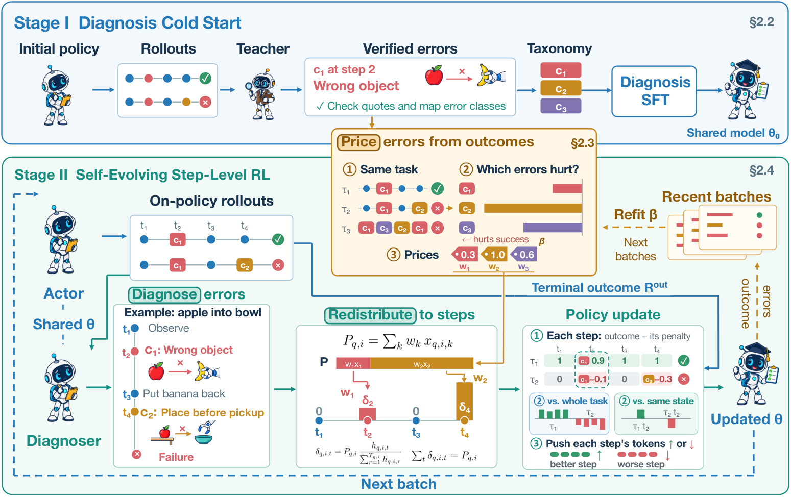

# My FAULT: Self-Diagnosis as Credit Assignment in Self-Evolving Agentic Reinforcement Learning

> **复现级别：L1 核心机制诊断。** 执行 verified diagnosis、error cost 与守恒重分配；未共同训练策略/诊断模型。

## 论文信息

| 字段 | 内容 |
|---|---|
| 论文链接 | [arXiv 2610.01161](https://arxiv.org/abs/2610.01161) |
| 公司/机构 | Alibaba Group（按第一作者署名单位） |
| 首次公开日期 | 2026-10-01（arXiv v1） |
| 原文开源代码 | 否：截至 2026-10-02 未找到原作者公开实现 |
| Adapter | `my-fault` |
| 本地复现代码 | [`src/auto_research/post_training/latest_20261002.py`](https://github.com/daiwk/auto-research/blob/main/src/auto_research/post_training/latest_20261002.py) |

## 原始论文总结

### 背景与主要改动

自诊断器提出错误类别与位置，只有经证据验证的 claim 才进入在线 error pricing；学得的相对成本把终局 credit 守恒地重分配到步骤。

<!-- paper-figure:start -->
### 原论文关键图

> **原论文关键图**：展示论文核心架构、训练流程或系统协议。图片来自[原论文](https://arxiv.org/abs/2610.01161)，版权归原作者所有；点击图片可查看来源。
<!-- paper-figure:end -->

### 核心公式

$\sum_t r'_t=R$，$r'_t=R(1/T+\bar p-p_t)$。

### 论文离线与线上效果

ALFWorld signal coverage 95%，相比 GRPO 41%、GiGPO 72%；在 ALFWorld 与 WebShop 上取得强改进。

## 本地复现

> **本地对照口径**：基线为机制关闭或默认状态，实验组为开启对应核心算子；相对百分比不适用。本批指标只验证不变量、梯度或状态转换，不表示论文规模效果。

- 三种子诊断：[`metrics/mechanism-seeds42-44.json`](metrics/mechanism-seeds42-44.json)
- `diagnostic_only=true`，不进入正式能力排名。

## 复现边界

执行 verified diagnosis、error cost 与守恒重分配；未共同训练策略/诊断模型。
