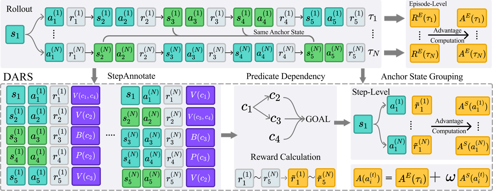

# Dependency-Aware Reward Shaping for Agentic Reinforcement Learning

> **复现级别：L1 核心机制诊断。** 执行依赖衰减、失效/修复与 potential 差分；未训练 1.5B–8B 模型，官方仓库当前仅发布接口说明、代码仍在准备。

## 论文信息

| 字段 | 内容 |
|---|---|
| 论文链接 | [arXiv 2610.01207](https://arxiv.org/abs/2610.01207) |
| 公司/机构 | University of Illinois Urbana-Champaign（按第一作者署名单位） |
| 首次公开日期 | 2026-10-01（arXiv v1） |
| 原文开源代码 | 否：官方仓库 [官方占位仓库](https://github.com/JianhuiWei7/DARS) 已建立，但截至 2026-10-02 明确标注实现仍在准备中 |
| Adapter | `dars` |
| 本地复现代码 | [`src/auto_research/post_training/latest_20261002.py`](https://github.com/daiwk/auto-research/blob/main/src/auto_research/post_training/latest_20261002.py) |

## 原始论文总结

### 背景与主要改动

把任务进度表示为带先决条件的 predicate 图；验证、失效和修复事件更新图状态，最近破损依赖按图距离衰减已完成工作的 credit，独立分支不受牵连。

<!-- paper-figure:start -->
### 原论文关键图

> **原论文关键图**：展示论文核心架构、训练流程或系统协议。图片来自[原论文](https://arxiv.org/abs/2610.01207)，版权归原作者所有；点击图片可查看来源。
<!-- paper-figure:end -->

### 核心公式

$r_t=\Phi(s_{t+1})-\Phi(s_t)$，依赖破损后的 predicate 权重为 $\gamma^{d}$。

### 论文离线与线上效果

同预算下 ALFWorld 相对 GiGPO 最高提升 10 点，并在 WebShop、Search-R1、AIME 与工具无关推理上验证。

## 本地复现

> **本地对照口径**：基线为机制关闭或默认状态，实验组为开启对应核心算子；相对百分比不适用。本批指标只验证不变量、梯度或状态转换，不表示论文规模效果。

- 三种子诊断：[`metrics/mechanism-seeds42-44.json`](metrics/mechanism-seeds42-44.json)
- `diagnostic_only=true`，不进入正式能力排名。

## 复现边界

执行依赖衰减、失效/修复与 potential 差分；未训练 1.5B–8B 模型，官方仓库当前仅发布接口说明、代码仍在准备。
