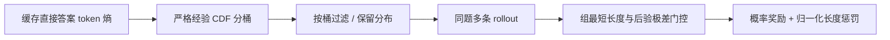
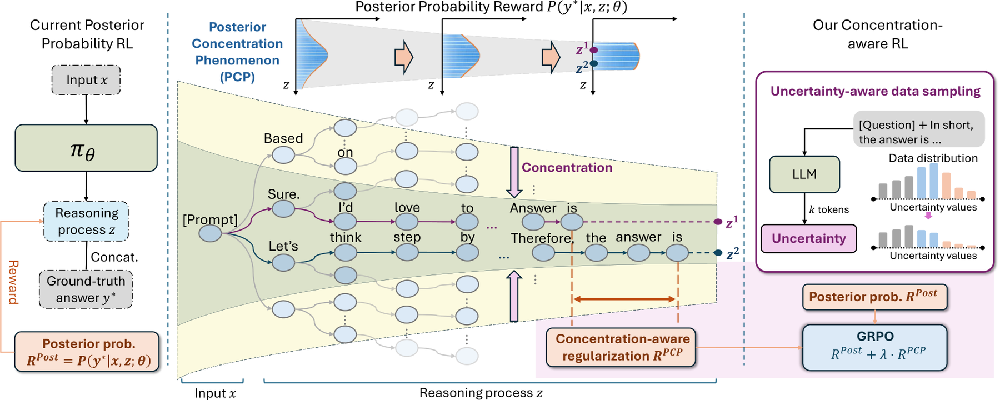

# RLCPR：后验集中下的概率奖励优化

> **L1 奖励与课程分布诊断**：实现论文集中度门控、长度惩罚和低熵数据分布；未运行完整语言模型 RL。

## 论文信息

| 字段 | 内容 |
|---|---|
| 论文链接 | [arXiv 2610.01458](https://arxiv.org/abs/2610.01458) |
| 公司/机构 | National University of Singapore（一作 Shiu-Hong Kao） |
| 首次公开日期 | 2026-10-01（arXiv v1） |
| 原文开源代码 | 未找到作者公开代码（2026-10-04 全文核查） |
| Adapter | `rlcpr`（Python 机制 API） |
| 本地复现代码 | [`src/auto_research/post_training/oct04_objectives.py`](https://github.com/daiwk/auto-research/blob/main/src/auto_research/post_training/oct04_objectives.py) |

## 原始论文总结

### 背景与主要改动

概率奖励在同组推理后验接近时难以区分冗长推理；RLCPR 只对“全组都长、答案后验又集中”的组施加相对长度惩罚。另用直接作答时的 token 平均熵把数据分层，让保留分布偏向低不确定样本。

<!-- paper-figure:start -->
### 原论文关键图

> **原论文 Figure 3（关键图）**：展示原论文提出的核心架构、主要模块及其连接关系。图片来自[原论文](https://arxiv.org/abs/2610.01458)，版权归原作者所有；点击图片可查看来源。
<!-- paper-figure:end -->

### 核心公式

$F(h_i)=N^{-1}\sum_j\mathbf1[h_j<h_i]$，使用严格小于以一致处理熵并列值。
桶保留权重为 $1-r_{bin(i)}$；函数返回归一化的期望保留分布，调用方据此采样。

$$
I_g=\mathbf1[\min_i L_{gi}>\delta]\mathbf1[\max_i p_{gi}-\min_i p_{gi}<\alpha],
$$

$$
r_{gi}=p_{gi}-\lambda I_g\frac{L_{gi}-\min_j L_{gj}}{\max(\max_jL_{gj}-\min_jL_{gj},1)}.
$$

$\delta$ 为 batch 长度分位数、$\alpha$ 为组内后验极差的 batch 分位数；等号不激活门控，不能改成全局固定长度惩罚。

### 论文离线与线上效果

论文表 1 报告相对同 backbone 的 RLPR，在七个 benchmark 中六个改善，平均准确率提高 1.8 个百分点，并改善训练 token 效率。表中不同任务的 Avg@k 采样次数不同，不能直接当成统一单次准确率。该结论来自论文完整训练，未报告生产线上 A/B。

## 本地复现

`PYTHONPATH=src python scripts/run_oct04_seven_papers.py`：短且后验分散的组不受惩罚；长且集中的组最长 rollout 惩罚为 -1，最短不罚。低熵样本保留概率约 0.333，高熵约 0.100。见[产物](metrics/mechanism-seeds42-44.json)。

API 拒绝非法概率、负长度和非有限值；奖励 stop-gradient。同值熵测试保证均匀分布；不同 seed 不会把确定性公式重复变成统计证据。

## 复现边界

调用方必须提供真实模型 token 熵、答案后验、长度及策略更新；本地手工输入是公式诊断，不是推理正确率或模型 RL 收益。没有 GPU/Evolve 正式能力集成。
