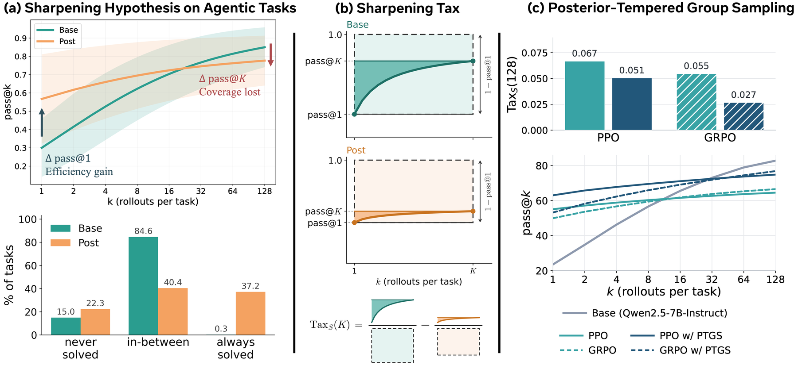

# Sharpening Tax in Post-Training

> **复现级别：L1 核心机制诊断。** 执行固定预算覆盖差指标；不运行 Meta 模型或 Agent 环境。

## 论文信息

| 字段 | 内容 |
|---|---|
| 论文链接 | [arXiv v1](https://arxiv.org/abs/2610.01509) |
| 公司/机构 | Meta Superintelligence Labs / University of Wisconsin–Madison（按第一作者署名单位） |
| 首次公开日期 | 2026-10-01（arXiv v1） |
| 原文开源代码 | 是：[https://github.com/changdaeoh/sharpening-tax](https://github.com/changdaeoh/sharpening-tax) |
| Adapter | `sharpening-tax` |
| 本地复现代码 | [`src/auto_research/post_training/latest_20261003.py`](https://github.com/daiwk/auto-research/tree/main/src/auto_research/post_training/latest_20261003.py) |

## 原始论文总结

### 背景与主要改动

比较 base 与后训练策略在固定采样预算下的任务覆盖；再用 posterior-tempered group sampling 按估计难度调温，兼顾 pass@1 与覆盖率。

<!-- paper-figure:start -->
### 原论文关键图

> **原论文 Figure 1（关键图）**：展示原论文的训练流程与关键优化环节。图片来自[原论文](https://arxiv.org/abs/2610.01509)，版权归原作者所有；点击图片可查看来源。
<!-- paper-figure:end -->

### 核心公式

$Tax_K=Coverage_K(base)-Coverage_K(post)$。

### 论文离线与线上效果

14 对 checkpoint、3 个 Agent benchmark 中税普遍存在；PTGS 同时改善单次准确率和覆盖。

## 本地复现

> **本地对照口径**：基线为机制关闭或默认状态，实验组执行定义性算子；L1 不报告正式相对提升，百分比不适用。

- 三种子诊断：[`metrics/mechanism-seeds42-44.json`](metrics/mechanism-seeds42-44.json)
- `diagnostic_only=true`，不进入正式能力排名。

## 复现边界

执行固定预算覆盖差指标；不运行 Meta 模型或 Agent 环境。
