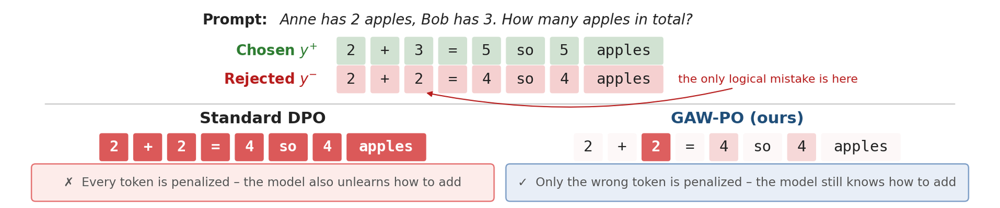

# GAW-PO: Preference Optimization with Gradient-Aligned Token Weights

> **复现级别：L1 核心机制诊断。** 执行梯度对齐权重；未进行 LoRA/DPO 训练。

## 论文信息

| 字段 | 内容 |
|---|---|
| 论文链接 | [arXiv v1](https://arxiv.org/abs/2610.01511) |
| 公司/机构 | National University of Science and Technology POLITEHNICA Bucharest（按第一作者署名单位） |
| 首次公开日期 | 2026-10-01（arXiv v1） |
| 原文开源代码 | 否：截至 2026-10-03 未找到原作者公开实现 |
| Adapter | `gaw-po` |
| 本地复现代码 | [`src/auto_research/post_training/latest_20261003.py`](https://github.com/daiwk/auto-research/tree/main/src/auto_research/post_training/latest_20261003.py) |

## 原始论文总结

### 背景与主要改动

用拒绝 token 梯度与 preferred update direction 的对齐度调节负权重；越支持优选行为的 token 越少受罚。

<!-- paper-figure:start -->
### 原论文关键图

> **原论文 Figure 1（关键图）**：展示原论文方法的总体设计和关键组成。图片来自[原论文](https://arxiv.org/abs/2610.01511)，版权归原作者所有；点击图片可查看来源。
<!-- paper-figure:end -->

### 核心公式

$w_t=1-[cos(g_t,g_+)]_+$。

### 论文离线与线上效果

11 个数学、推理、代码和 QA benchmark 平均优于 DPO 0.97 点。

## 本地复现

> **本地对照口径**：基线为机制关闭或默认状态，实验组执行定义性算子；L1 不报告正式相对提升，百分比不适用。

- 三种子诊断：[`metrics/mechanism-seeds42-44.json`](metrics/mechanism-seeds42-44.json)
- `diagnostic_only=true`，不进入正式能力排名。

## 复现边界

执行梯度对齐权重；未进行 LoRA/DPO 训练。
