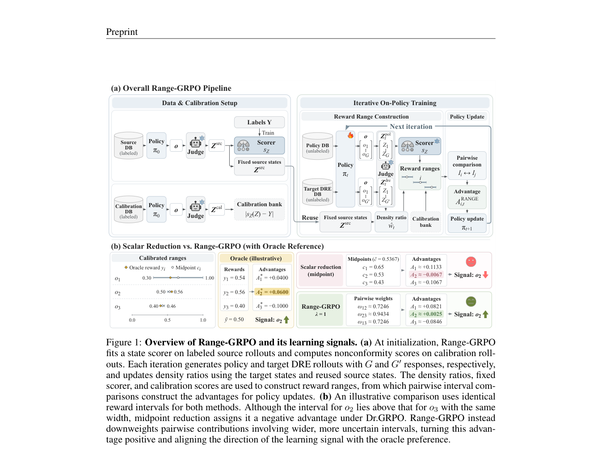

# Range-GRPO: Policy Optimization via Pairwise Relations among Reward Intervals

> **复现级别：L1 核心机制诊断。** 执行成对区间关系与 point-limit；不拟合 conformal judge，也不做大模型 GRPO。

## 论文信息

| 字段 | 内容 |
|---|---|
| 论文链接 | [arXiv 2610.01548](https://arxiv.org/abs/2610.01548) |
| 公司/机构 | Yonsei University（按第一作者署名单位） |
| 首次公开日期 | 2026-10-01（arXiv v1） |
| 原文开源代码 | 否：截至 2026-10-02 未找到原作者公开实现 |
| Adapter | `range-grpo` |
| 本地复现代码 | [`src/auto_research/post_training/latest_20261002.py`](https://github.com/daiwk/auto-research/blob/main/src/auto_research/post_training/latest_20261002.py) |

## 原始论文总结

### 背景与主要改动

用 conformal reward interval 代替单点 judge 分数；组内只对可确定排序的区间产生方向信号，区间重叠时不制造虚假偏好。

<!-- paper-figure:start -->
### 原论文关键图

> **原论文关键图**：展示论文核心架构、训练流程或系统协议。图片来自[原论文](https://arxiv.org/abs/2610.01548)，版权归原作者所有；点击图片可查看来源。
<!-- paper-figure:end -->

### 核心公式

$A_i=G^{-1}\sum_j relation([l_i,u_i],[l_j,u_j])$；区间塌缩为点时恢复 DR-GRPO。

### 论文离线与线上效果

论文在所评估半监督方法中取得最高的分布内与分布外平均表现，同时使用更少训练资源。

## 本地复现

> **本地对照口径**：基线为机制关闭或默认状态，实验组为开启对应核心算子。本批指标只验证不变量、梯度或状态转换，不表示论文规模效果。

- 三种子诊断：[`metrics/mechanism-seeds42-44.json`](metrics/mechanism-seeds42-44.json)
- `diagnostic_only=true`，不进入正式能力排名。

## 复现边界

执行成对区间关系与 point-limit；不拟合 conformal judge，也不做大模型 GRPO。
