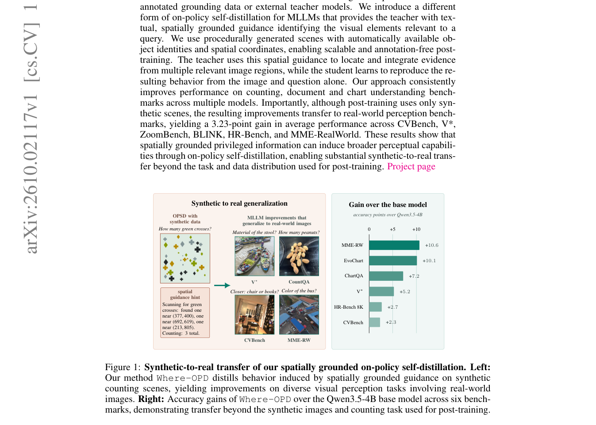

# Where-OPD: Spatially Guided On-Policy Self-Distillation of MLLMs with Synthetic Scenes

> **复现级别：L1 核心机制诊断。** 执行带 spatial mask 的 on-policy teacher KL；未生成场景、未加载 MLLM，也不把随机 logits 当作视觉效果。

## 论文信息

| 字段 | 内容 |
|---|---|
| 论文链接 | [arXiv 2610.02117](https://arxiv.org/abs/2610.02117) |
| 公司/机构 | Valeo.ai（按第一作者署名单位） |
| 首次公开日期 | 2026-10-01（arXiv v1） |
| 原文开源代码 | 是：[https://github.com/sirkosophia/Where-OPD](https://github.com/sirkosophia/Where-OPD) |
| Adapter | `where-opd` |
| 本地复现代码 | [`src/auto_research/post_training/latest_20261002.py`](https://github.com/daiwk/auto-research/blob/main/src/auto_research/post_training/latest_20261002.py) |

## 原始论文总结

### 背景与主要改动

程序化合成场景自动给出对象身份和空间坐标；teacher 接收文本化空间特权信息，student 只看图像与问题，在自己的 on-policy token 上蒸馏 teacher。

<!-- paper-figure:start -->
### 原论文关键图

> **原论文关键图**：展示论文核心架构、训练流程或系统协议。图片来自[原论文](https://arxiv.org/abs/2610.02117)，版权归原作者所有；点击图片可查看来源。
<!-- paper-figure:end -->

### 核心公式

$L=\sum_t m_t KL(\pi_T(\cdot|x,g),\pi_S(\cdot|x))/\sum_tm_t$。

### 论文离线与线上效果

只用合成场景后训练，在六个真实视觉 benchmark 上平均提高 3.23 点。

## 本地复现

> **本地对照口径**：基线为机制关闭或默认状态，实验组为开启对应核心算子；相对百分比不适用。本批指标只验证不变量、梯度或状态转换，不表示论文规模效果。

- 三种子诊断：[`metrics/mechanism-seeds42-44.json`](metrics/mechanism-seeds42-44.json)
- `diagnostic_only=true`，不进入正式能力排名。

## 复现边界

执行带 spatial mask 的 on-policy teacher KL；未生成场景、未加载 MLLM，也不把随机 logits 当作视觉效果。
