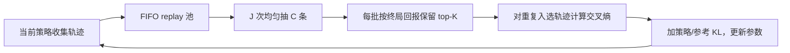
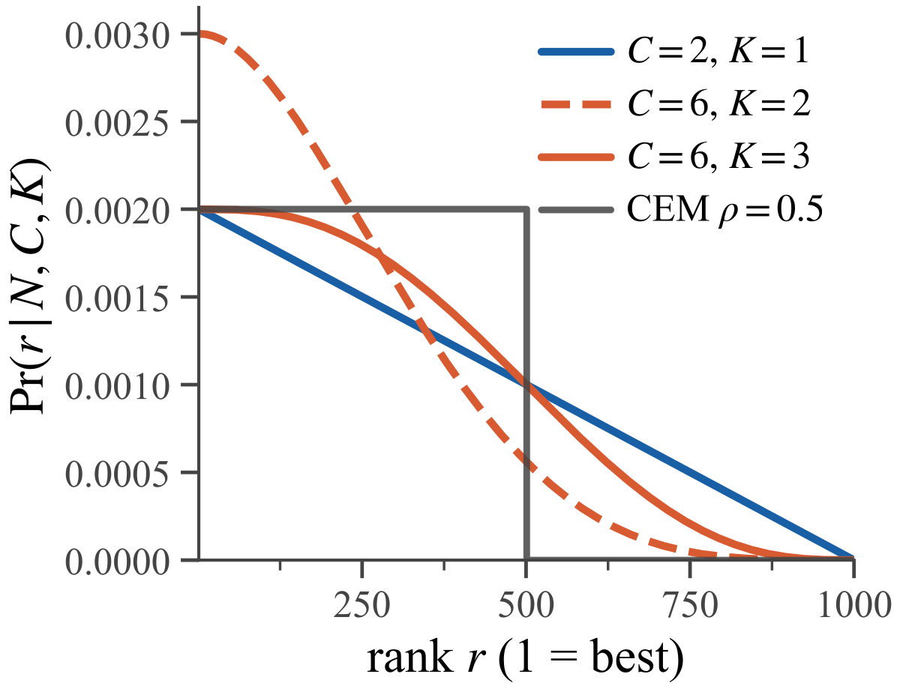

# Follow the Winners：用精英轨迹做保守策略改进

> **L1 核心机制诊断**。实现了论文 Algorithm 2 的 FIFO 轨迹池、重复小批量 top-$K$ 筛选和带 KL 正则的交叉熵策略投影；目前只在合成双臂 bandit 上执行，不等同于论文的 LLM Agent 训练。

## 论文信息

| 字段 | 内容 |
|---|---|
| 论文链接 | [arXiv 2610.03361 v1](https://arxiv.org/abs/2610.03361) |
| 公司/机构 | Trent AI Limited（一作 Joery A. de Vries；合作者兼属 University of Cambridge） |
| 首次公开日期 | 2026-10-02（arXiv v1；10 月 5 日公告） |
| 原文开源代码 | **尚未公开**；原文可复现性说明称录用和内部法务流程完成前不发布代码、模型及数据 |
| Adapter | `follow-the-winners`（独立 L1 机制 API，**未注册**完整 reproduce adapter） |
| 本地复现代码 | [`src/auto_research/post_training/follow_the_winners.py`](https://github.com/daiwk/auto-research/blob/main/src/auto_research/post_training/follow_the_winners.py)；[`scripts/run_follow_the_winners_20261005.py`](https://github.com/daiwk/auto-research/blob/main/scripts/run_follow_the_winners_20261005.py) |

## 原始论文总结

### 背景与主要改动

在有状态工具环境里，为同一提示重复生成一组等价 rollout 往往很贵；而 PPO 的 critic 又占用额外模型资源。FTW 不计算 value，也不要求 GRPO 式同题多轨迹。它保留近期策略产生的真实轨迹，从 FIFO 池中反复抽取小批量、仅模仿每批回报最高的 $K$ 条，并用 KL 约束更新幅度。过去轨迹被再次选中的次数自然形成训练权重，而不是对整池只做一次硬截断。



<!-- paper-figure:start -->
### 原论文关键图

[](https://arxiv.org/html/2610.03361)

> **原论文 Figure 1**：不同 $C,K$ 下轨迹按回报排名被保留的概率。$C$ 控制集中度，$K$ 越大筛选越软。图片来自[原论文](https://arxiv.org/abs/2610.03361)，版权归原作者所有；点击图片可查看来源。
<!-- paper-figure:end -->

### 核心公式

对容量 $N$ 的轨迹池，排名 $r=1$ 为回报最高。一次不放回抽取 $C$ 条、保留其中 $K$ 条时，论文 Eq. (5) 的归一化排名占用率为

$$
P(r\mid N,C,K)=\frac{1}{K\binom{N}{C}}\sum_{k=1}^{K}\binom{r-1}{k-1}\binom{N-r}{C-k}.
$$

本地实现显式检查该分布求和为 1；$K=C$ 时退化为均匀抽样，$C=N$ 时对应整池 CEM。训练目标是对 $J$ 批精英轨迹的动作对数似然做平均，再加相对参考策略的 KL。**同一轨迹可跨批重复入选**，这正是论文筛选分布的组成部分。

### 论文离线与线上效果

论文在 Qwen2.5-3B-Instruct 的 Search-R1 上报告 35.46% ± 0.15% exact match；所列 PPO/GRPO 基线分别为 32.5%/33.6%。Sokoban 实验报告 FTW 在部分 $(C,K)$ 配置下与 PPO/GRPO 接近，但 $K=3,C=5$ 曾发生性能坍塌，说明二值回报大量并列时筛选可能误模仿失败轨迹。上述均是**原论文结果**，不是本地结果；未报告生产线上 A/B。

## 本地复现

```bash
PYTHONPATH=src python scripts/run_follow_the_winners_20261005.py
python -m pytest tests/test_follow_the_winners_20261005.py
```

三 seed 的确定性机制回执在[本地指标](metrics/bandit-seeds42-44.json)：合成连续回报双臂 bandit 上，最优臂选择概率从 0.5 变为约 0.968；这是**教学规模机制检查**，不与原论文 Search-R1 数值对照。测试还检查 Eq. (5) 归一化、重复精英入选、FIFO 过期和策略梯度方向。

## 复现边界

没有训练 Qwen、运行 Sokoban/Search-R1，也没有与同预算 PPO/GRPO 比较；bandit 的已知均值只用于诊断，不构成验证集/测试集上的调参或能力评测。该产物标记 `diagnostic_only=true`、`formal_comparison=false`，不参与公开能力提升或 Evolve 晋级。升级到正式比较需真实工具轨迹与可复现终局回报、相同采样预算及多 seed 基线；若宣称 CUDA 路径，还需 A100/A30 执行及脱敏回执。
