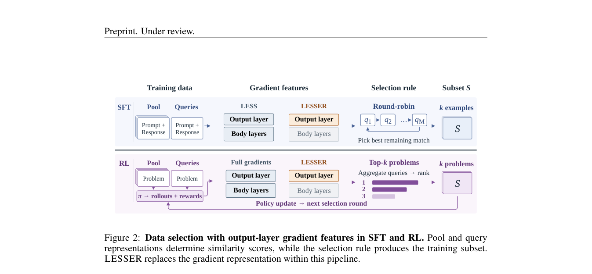

# LESSER：用输出层梯度筛选后训练数据

> **L1 前向特征与筛选协议诊断**。已实现论文的输出层梯度、双侧随机投影及保持不变的 round-robin 选择；没有宣称复现大模型微调、RL、教师选择或论文速度收益。

## 论文信息

| 字段 | 内容 |
|---|---|
| 论文链接 | [arXiv 2610.03702 v1](https://arxiv.org/abs/2610.03702) |
| 公司/机构 | University of Pennsylvania（一作 Lyuxin David Zhang） |
| 首次公开日期 | 2026-10-02（arXiv v1；10 月 5 日公告） |
| 原文开源代码 | 未找到作者公开代码（2026-10-05 核查原文 HTML） |
| Adapter | `lesser`（独立机制 API，**未注册**完整 reproduce adapter） |
| 本地复现代码 | [`src/auto_research/post_training/lesser.py`](https://github.com/daiwk/auto-research/blob/main/src/auto_research/post_training/lesser.py)；[`scripts/run_lesser_20261005.py`](https://github.com/daiwk/auto-research/blob/main/scripts/run_lesser_20261005.py) |

## 原始论文总结

### 背景与主要改动

现有面向目标任务的数据选择常计算每个候选样本和少量目标任务 query 的全参数梯度，再按相似性选取训练子集；对大模型逐样本反传代价很高。LESSER 只替换**特征**：从一次前向得到的最后隐藏状态和词表概率解析地计算输出层梯度。SFT、RL 问题选择或教师选择原有的选择规则不需要改变。


<!-- paper-figure:start -->
### 原论文关键图

[](https://arxiv.org/pdf/2610.03702#page=4)

> **原论文 Figure 2（关键图）**：展示原论文的整体流程、关键阶段及其数据流向。图片来自[原论文](https://arxiv.org/abs/2610.03702)，版权归原作者所有；点击图片可查看来源。
<!-- paper-figure:end -->

### 核心公式

对固定权重 $\alpha_t$ 的 token 损失，论文 Proposition 1 给出

$$
g_p=\sum_t\alpha_t\bigl(\operatorname{softmax}(Wh_t)-e_{y_t}\bigr)h_t^\top.
$$

Appendix B.2 使用对候选池与 query **共同固定**的 Rademacher 矩阵 $\Pi_1,\Pi_2$，在 token 层先投影残差和隐藏状态，而不先物化完整的 $|V|\times d$ 梯度：

$$
\phi_p=\frac{\operatorname{vec}(\Pi_1g_p\Pi_2)}{\|\Pi_1g_p\Pi_2\|_F}.
$$

输出层必须视为一份独立 readout；若 tied embedding 的隐藏状态也依赖同一参数，不能把全模型梯度错当此公式。零权重 token 不贡献；RL 可传入带符号 advantage。query 只能取验证/目标代理集，隔离 test 不可用于选样。

### 论文离线与线上效果

原文报告的**特征提取** FLOPs 在 SFT/RL 场景分别比全梯度基线低 9.7×/3.0×；这是论文结果，不是本地测速。SFT 在四种 LLM、五种任务、三档预算的比较中，LESSER 与 LESS 的平均绝对成绩差为 1.3 分；两者算法流程并非仅有特征差异，原文也明确提示了这一限制。论文未报告生产线上 A/B。

## 本地复现

运行：

```bash
PYTHONPATH=src python scripts/run_lesser_20261005.py
python -m pytest tests/test_lesser_20261005.py
```

三个 seed 分别检查解析公式与独立 readout 自动微分的最大绝对差、逐 token 双侧投影与完整梯度再投影的最大绝对差，并检查 round-robin 无重复选样。数值见[机制产物](metrics/mechanism-seeds42-44.json)。测试还覆盖负权重、零权重、维度与预算错误。

## 复现边界

这里的隐藏状态和 logits 来自固定随机张量，用于 **公式与选择器的确定性验证**；没有在公开 Tulu V2、GSM8K 等数据上运行真实 LLM，也没有比较训练后的任务效果或 A100 吞吐。因此标记 `diagnostic_only=true`，不进入正式能力看板或 Evolve 增益候选。若要升级为 L2，需固定公开 checkpoint/数据修订、query/test 切分、同预算 LESS/随机对照和多 seed 下游训练；若 CUDA 路径成为广告能力，还须 A100/A30 实测回执。
