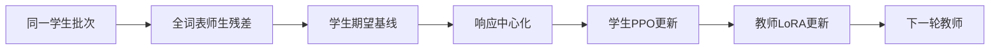

# residual-advantage：Residual Advantage: Student-Relative Teacher Guidance for RL with Verifiable Rewards

> 核心机制实现；短预算真实 checkpoint 运行只验证训练链路，不等同论文规模能力复现。

## 论文信息

| 字段 | 内容 |
|---|---|
| 论文链接 | [原文](https://arxiv.org/abs/2610.11519) |
| 公司 / 机构 | Harbin Engineering University / Tencent / Harbin Institute of Technology（第一作者署名） |
| 首次公开日期 | 2026-10-08（arXiv v1） |
| 原作者代码 | 截至 2026-10-10 未发现 / 未发布原作者代码 |
| 本地 adapter / 方法 | `residual-advantage` |
| 本地复现代码 | [oct10_objectives.py](https://github.com/daiwk/auto-research/blob/main/src/auto_research/post_training/oct10_objectives.py)、[oct10_checkpoint.py](https://github.com/daiwk/auto-research/blob/main/src/auto_research/post_training/oct10_checkpoint.py) |

## 原始论文总结

### 背景与主要改动

把全词表师生概率残差变成相对学生的有界局部优势，再逐响应中心化，与验证器优势相加。Co-RA 在同一已评分学生批次上更新教师 LoRA，下一轮才使用新教师。

### 核心公式

$d=q-p$，$a_t=d(y_t)-\sum_vp(v)d(v)$；$A_t=A_{\mathrm{verifier}}+\lambda(a_t-\bar a)$。Co-RA 的教师更新仅使用固定验证器优势，先评分再分别更新，禁止中途重算标签。

### 论文离线与线上效果

原文 RA 在 24 组比较中均改进基础序列优势算法，Co-RA 进一步提高 Avg@8。未报告线上 A/B。

## 本地复现

核心入口为 `residual_advantage / co_ra_step`；实际 checkpoint 命令入口是 `scripts/run_oct10_post_training.py --objective residual-advantage`。同篇的 Co-RA 使用 `--objective co-ra`。

必须显式提供本地 checkpoint 路径、公开模型 ID/revision、公开 GSM8K train/validation JSONL、数据 revision 和输出目录；运行 `python scripts/run_oct10_post_training.py --help` 查看完整参数。不自动下载或上传私有数据。教师与学生必须逐 token 词表一致；只支持含 q_proj/v_proj 的因果 LM，基础参数冻结，LoRA 实际训练。

### 数据协议与结果

生成器只读取问题。答案只用于外部数值验证器。训练与验证问题重叠会报错；训练后才执行隔离验证，不据验证选择超参。报告保存 seed、数据哈希、checkpoint revision、token 数、loss 和实际参数变化。

GPU 实测摘要与脱敏证据由同批集成阶段写入；未有实测报告时不能宣称验证通过。短生成截断、少量问题和单 seed 只支持 runtime smoke，不支持数学能力提升结论。

### 代码映射与复现边界

公式和选择器位于 `oct10_objectives.py`，LoRA/rollout/教师评分/优化/验证位于 `oct10_checkpoint.py`，契约测试位于 `tests/test_oct10_objectives.py` 和 `tests/test_oct10_checkpoint_contracts.py`。没有完成论文原训练数据、完整训练预算和多 benchmark 对照；未接入 Evolve 多轮控制器，不把方法索引标签当作 Evolve 集成。
