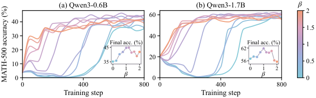

# dial-opd：DIAL-OPD: Learning More from Fewer Tokens in On-Policy Distillation

> 核心机制实现；短预算真实 checkpoint 运行只验证训练链路，不等同论文规模能力复现。

## 论文信息

| 字段 | 内容 |
|---|---|
| 论文链接 | [原文](https://arxiv.org/abs/2610.11659) |
| 公司 / 机构 | Eastern Institute of Technology, Ningbo / The Hong Kong Polytechnic University（第一作者署名） |
| 首次公开日期 | 2026-10-08（arXiv v1） |
| 原作者代码 | [已开源](https://github.com/EIT-NLP/DIAL-OPD) |
| 本地 Adapter / 方法 | `dial-opd` |
| 本地复现代码 | [oct10_objectives.py](https://github.com/daiwk/auto-research/blob/main/src/auto_research/post_training/oct10_objectives.py)、[oct10_checkpoint.py](https://github.com/daiwk/auto-research/blob/main/src/auto_research/post_training/oct10_checkpoint.py) |

## 原始论文总结

### 背景与主要改动

用概率的对数均值调节教师—学生对数差异，降低两者都不认可的低概率 token 的监督优先级。按每条响应选取高分位置，未选位置仍保留为上下文。

<!-- paper-figure:start -->
### 原论文关键图

> **原论文 Figure 6（关键图）**：比较不同密度调节参数 β 下的训练曲线与最终准确率，说明固定 token 保留率时监督分配仍影响学习动力学。图中为原论文结果，非本地短跑结果。图片来自[原论文](https://arxiv.org/abs/2610.11659)，版权归原作者所有；点击图片可查看来源。
<!-- paper-figure:end -->

### 核心公式

令 $p_t,q_t$ 为采样 token 的学生、教师概率，$L(p,q)=(q-p)/(\log q-\log p)$。选择分数为 $L(p_t,q_t)^\beta|\log q_t-\log p_t|$；选择后优化 $-\operatorname{sg}(\log q_t-\log p_t)\log p_t$。相等概率使用连续极限。

### 论文离线与线上效果

原文四组师生、七个数学任务中，40% token 保留率的平均准确率收益最高为 5.25 个百分点。未报告线上 A/B。

## 本地复现

完整安装、数据格式、可直接改路径运行的命令见[checkpoint 运行说明](../oct10-checkpoint-guide.md)。

核心入口为 `dial_opd_scores / dial_opd_loss`；实际 checkpoint 命令入口是 `scripts/run_oct10_post_training.py --objective dial-opd`。

必须显式提供本地 checkpoint 路径、公开模型 ID/revision、公开 GSM8K train/validation JSONL、数据 revision 和输出目录；运行 `python scripts/run_oct10_post_training.py --help` 查看完整参数。不自动下载或上传私有数据。教师与学生必须逐 token 词表一致；只支持含 q_proj/v_proj 的因果 LM，基础参数冻结，LoRA 实际训练。

### 数据协议与结果

生成器只读取问题。答案只用于外部数值验证器。训练与验证问题重叠会报错；训练后才执行隔离验证，不据验证选择超参。报告保存 seed、数据哈希、checkpoint revision、token 数、loss 和实际参数变化。

NVIDIA A100 上已执行真实 Qwen3-4B 学生与公开 MOPD 教师的 LoRA 训练（seed 42，2 步）。学生有效梯度步数 2，adapter 参数变化 L2 为 0.019681。隔离验证仅 2 题，exact match 为 0.5；不能据此宣称收益。详见 [实际指标](metrics/checkpoint-a100-seed42.json) 和 [脱敏 GPU 证据](../../gpu-validations/dial-opd-a100-20261010.json)。

短生成截断、少量问题和单 seed 只支持 runtime smoke，不支持数学能力提升结论。

### 代码映射与复现边界

公式和选择器位于 `oct10_objectives.py`，LoRA/rollout/教师评分/优化/验证位于 `oct10_checkpoint.py`，契约测试位于 `tests/test_oct10_objectives.py` 和 `tests/test_oct10_checkpoint_contracts.py`。没有完成论文原训练数据、完整训练预算和多 benchmark 对照；未接入 Evolve 多轮控制器，不把方法索引标签当作 Evolve 集成。
